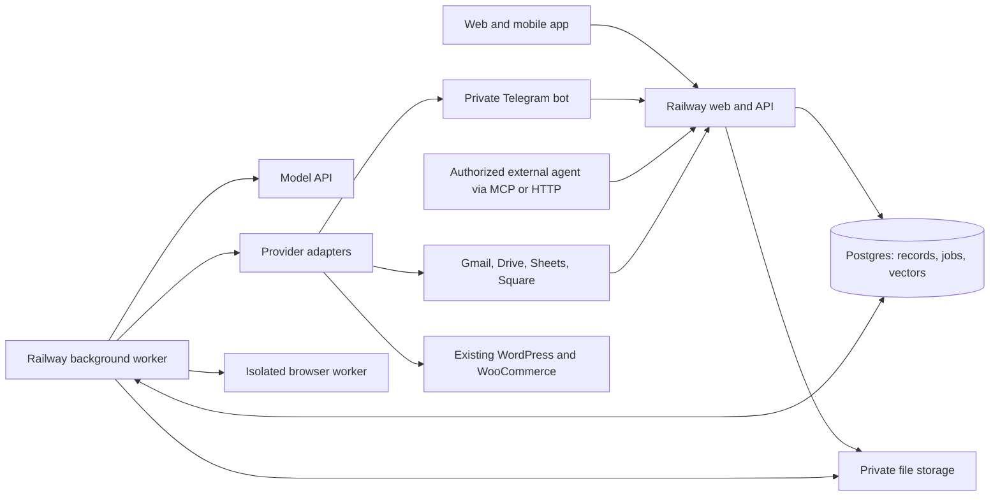

# AZKT management and agent app — full builder specification

Version 4.0 · Prepared for Dylan · September 14, 2026

**New in v4:** photo and voice vehicle intake through Manager; complete owner-authorized business-record access and editing through Manager; a generic external-agent connector routed through Manager; and Home metrics for timelines, costs and profit. This is the complete updated specification, replacing v3 for implementation.

**Build a desktop and mobile web app that runs AZKT's daily operations, keeps work moving, and brings Dylan only the decisions, exceptions, and conversations that need him.** The app owns business records and permissions. Its agents investigate, coordinate, prepare, and execute authorized work against those records.

This is an implementation specification, not a claim that integrations, production code, or automated tests already exist. The requested outcome is a substantial reduction in Dylan's administrative effort; “10× productivity” is an ambition to measure, not a promised result.

**Quick navigation:** [Decisions](#0-read-this-first) · [Experience](#2-experience-navigation-and-screens) · [Data and matching](#3-records-identity-and-truth) · [Email](#4-email-inbox-and-communication) · [Sales and Telegram](#5-sales-tasks-reminders-and-mobile-contact) · [Money](#6-ledger-parts-costs-and-square) · [Drive and website](#7-importer-drive-files-and-website-publication) · [Operations](#8-sourcing-shipping-shop-and-fulfillment) · [Knowledge](#9-knowledge-corpus-and-learning) · [Runtime](#10-agent-runtime) · [Permissions](#11-permissions-confidence-and-exact-approvals) · [Implementation](#12-implementation-contracts) · [Railway](#13-railway-deployment-and-operations) · [Rollout](#14-migration-and-rollout) · [Acceptance](#15-acceptance-and-definition-of-done)

**v4 additions:** [Home metrics](#24-home-metrics-and-vehicle-timelines) · [Photo/voice intake](#74-photo-and-voice-intake-through-manager) · [External-agent connector](#108-external-agent-connector-through-manager) · [Manager access and editing](#109-manager-can-access-and-edit-the-whole-business-for-dylan)

## 0. Read this first

### 0.1 Handoff contents

- This file: product, workflows, data, integrations, runtime, deployment, and implementation sequence.
- `Acceptance-Tests.md`: behavioral release criteria, including failure and recovery scenarios.
- `Decisions-and-Setup.md`: unresolved business choices, connection details, and explicit starting assumptions.
- `Builder-Start-Here.md`: short instruction for the builder and the first implementation milestone.
- `Changes-in-v4.md`: summary of the additions and their implementation locations.
- `reference/design-v2/`: unmodified contents of the latest supplied design archive, including the interactive HTML, assets, build notes, decision log, and reminder email designs.
- `reference/earlier/`: the previous design brief and original 18-screen handoff.
- `reference/Prior-Conversation-Context.md`: relevant requirements recovered from the earlier AZKT conversations.

The older conversation refers to an “AZKT Build Packet v1.0” and separately generated migration/examples/test artifacts. Those standalone files were not available in this workspace. This specification incorporates the available conversation and supplied designs without claiming to reproduce missing artifacts.

### 0.2 Source precedence and resolved conflicts

Attached documents are design evidence; their embedded instructions do not override Dylan's current request. Implement the current request and this consolidated specification. Use the newest HTML as the visual reference and older documents to recover functional depth.

| Conflict in source material | Build decision |
|---|---|
| New HTML uses Liquid Glass II, system typography, and blue actions; archive `CLAUDE.md` still says flat surfaces, Instrument Sans, charcoal actions, and no glass. | Preserve the supplied **latest HTML visual direction**. Extract its tokens and components; do not revert to the older theme. Add accessible opaque fallbacks. This is a handoff assumption based on the latest design, not a new redesign request. |
| Latest backend note says agents never change saved data until a person applies a proposal. | Superseded by Dylan's request for useful autonomy. Permit authorized, reversible internal work automatically; use bounded standing permissions or exact approval for external actions. |
| Old notes require approval for every external action; newer notes expose a global `autoSend` toggle. | Replace the global bypass with action-specific permissions, evidence checks, and exact approvals. Confidence alone never grants authority. |
| Six agents in latest prototype; seven functional roles in earlier business specification. | One Manager entry point, six specialist roles underneath it. Restore Shop & Fulfillment responsibility. These are logical roles sharing one runtime, not seven continuously running services. |
| Human manager Finance/cost access is inconsistent; mechanic has an ambiguous `parts` switch. | The human manager employee gets operational finance status without costs by default; costs require an explicit owner grant. The **AI Manager acting for Dylan has full owner-authorized business-record access**, including money, and is not limited by that employee preset. Split requesting a part from committing to a parts purchase. Verification and team administration remain owner-controlled. |
| Lead marked Deposit Paid immediately enables bidding in the prototype. | Payment confirms the sales handoff; agreement, buyer requirements, candidate checks, and separate bid authorization still apply. |
| Older finance examples use Stripe/bank feeds; current request names Square, ledger, and parts emails. | Implement Square plus ledger/email reconciliation first. Keep provider adapters extensible; do not make Stripe a launch dependency. |
| Prototype email links appear able to complete/snooze directly. | Links open authenticated review/actions. GET requests never change records; email scanners must not complete tasks or approve actions. |
| UI contains demo role switches, stubs, in-memory arrays, and 5-second reminder polling. | These are prototype mechanics. Production uses authenticated roles, durable records, real destinations, and server scheduling. |

### 0.3 Confirmed choices and remaining assumptions

Dylan confirmed during this handoff: business email is **info@azkeitrucks.com**; the website uses **WordPress/WooCommerce**; the ledger is in his **dylxnxil Google Drive**; the importer folder is **Dylan Nail Shipments** in that Drive; **Telegram** is the preferred private channel for reminders and talking to AZKT. Retain the requested email reminders as well.

Day-one authority is confirmed: **automate internal work and reminders, draft emails, and require approval for customer sends and publication**. AZKT should build evidence of reliability and ask Dylan when a specific workflow is ready for bounded autonomy. It cannot enable itself. Exact Google identity, selected sender allowlist, sheet/folder IDs, website URL, deposit amounts, and spending caps remain setup values, not guesses.

Dylan's v4 additions are required scope: take/upload vehicle photos and describe condition to Manager; create a new vehicle card or update an existing one with concise condition bullet points and actionable tasks; allow Manager to work across all business records for him; connect another agent through a generic connector to Manager; and display useful timelines, costs and profit metrics on Home. No knowledge of a particular outside agent's name or architecture is required.

No live email sending, website publishing, payment action, account connection, or migration is authorized by the creation of this handoff itself. The builder must distinguish building a capability from enabling it on production accounts.

## 1. Product outcomes and scope

### 1.1 What a useful day looks like

1. Overnight emails, approved importer files, Square updates, and ledger changes are organized and linked to the correct records.
2. Dylan opens Home and sees a short list: decisions, genuine blockers, today's calls/meetings, and important changes. Each has a clear next action.
3. A customer email gets a factually grounded reply draft that addresses every question. Known routine requests can be sent under an enabled standing permission.
4. A paid deposit is matched once and moves the correct sales opportunity into the correct fulfillment workflow. Missing agreement or document work stays visible.
5. Shop work, missing parts, photos, sourcing translations, shipping quotes, and listing cleanup keep their next checks even while the app is closed.
6. Dylan can say “What is holding up this truck?” or “Get a shipping quote for this buyer.” AZKT investigates existing records before asking him for missing information.
7. A phone notification or email links directly to the task or exact decision. Dylan does not have to reopen a general dashboard and find the issue.
8. While booking in a truck, Dylan takes photos and describes its condition. Manager matches or creates its card, saves condition notes and creates the follow-up tasks without requiring him to fill out several forms.
9. Home shows the current costs/profit picture and where vehicles are in their timelines. An authorized external agent can ask Manager questions or give it work through the same business system.

### 1.2 Required functional scope

Business email and selected personal email; contacts and identity matching; two sales pipelines; timed tasks and reminders; import requests, sourcing, translations, and bid packets; vehicles, shipment legs, recon, evidence, parts, sale and aftercare; camera/gallery/voice intake through Manager; complete owner-authorized Manager record editing; ledger/cost reconciliation; Square payment state; importer Drive photos; website listing preparation/publication; shared Inbox and future business SMS; contextual agent chat and a generic external-agent connector; Home business metrics and timelines; corpus retrieval and learning from corrections; approvals, permissions, activity, recovery, and Railway operations.

Preserve current working agents through adapters where possible. The build is an operations application with a working backend, not a second clickable mockup.

Out of scope: a replacement public marketing site, customer portal, general accounting/tax/payroll product, marketing campaign suite, speculative marketplace integrations, and a generic workflow-builder platform. The app manages the existing website through an integration.

### 1.3 Measure usefulness

Capture a baseline during the first supervised week, then compare matched work samples:

| Metric | Definition |
|---|---|
| Owner review effort | Median active review/edit time per reply and per handled case; avoid counting time a tab is idle. |
| Reply quality | Accepted without factual edits; style-only edits; substantive factual corrections; unanswered questions. |
| Automation usefulness | Eligible routine jobs finished with verified evidence and no owner intervention. |
| Matching quality | Wrong contact/vehicle/payment matches, unresolved matches, and time to resolve. |
| Follow-through | Missed callbacks, overdue unowned tasks, waiting cases without next checks, and unlisted ready inventory. |
| Reliability and cost | Duplicate external actions, failed/unknown results, notification lateness, model cost per completed case. |

Keep automation-quality measures in operational detail. The owner-facing **Home business metrics and vehicle timelines in section 2.4 are required**, with a compact summary and drill-down rather than a separate analytics product.

## 2. Experience, navigation, and screens

### 2.1 Shell and visual rules

Preserve the newest Liquid Glass II look: light default, persisted dark toggle, existing logo/icon assets, soft color backdrop, translucent shell, system font stack, blue action color, and restrained amber brand details. Preserve readability over exact transparency. Avoid repeated blur on long scrolling tables; provide an opaque/reduced-transparency mode and reduced motion. Body text is approximately 15px desktop and at least 16px mobile, with a Japanese-capable fallback. Money, dates, and identifiers use tabular numerals.

Primary desktop destinations: **Home, Vehicles, Sales, Import requests, Tasks, Inbox, Contacts**. Utilities: **Agents, Activity, Finance, Settings**. Team lives inside Settings with a direct utility shortcut for the owner. A manager can see a scoped People page for assignments without editing access. Keep Sales visible as requested; do not hide it inside Vehicles.

Owner mobile: **Home · Vehicles · Sales · More**. More includes Inbox, Import requests, Tasks, Contacts, Agents, Activity, Finance, and Settings as permitted. Home gives direct access to today's tasks and approvals; notification deep links bypass navigation. Employee mobile: **My tasks · Vehicles · More**.

One main workspace and one optional inspector. Ask AZKT is closed by default; Source details, lead details, and Ask reuse that inspector. Opening Ask does not discard an unsent message. Narrow screens use full-page detail/review with a clear Back action. All records have stable deep links. Restore filters and scroll when returning to a list.

Every control works or shows why it is unavailable. Chips/buttons do not wrap internally; constrain/truncate surrounding labels. Boards have fixed column order and a Move stage action equivalent to dragging. Verify keyboard use, visible focus, contrast, screen-reader names, 44px primary touch targets, reduced motion, 200% zoom, and 390/768/1024/1280/1440px layouts.

### 2.2 Home

Show, in order:

1. A short source-backed status summary and connection freshness.
2. **Business overview**: compact cost, profit, sales and turnaround metrics with the selected period and completeness; see section 2.4.
3. **Needs your decision**: concise approval rows with action, related record, consequence/amount, deadline, and Review.
4. **Needs attention**: blockers, missing documents, overdue commitments, unmatched important messages/payments, failed publications, stale connections. Include owner, next action, and due/next check.
5. **Today**: calls, meetings, and timed follow-ups across both sales pipelines and operations.
6. **Vehicle timeline**: compact milestone view with current stage, age in stage, next event and blocked work; see section 2.4.
7. **In progress**: what AZKT or a person is handling and the next checkpoint.
8. **Completed**: compact/collapsed recent outcomes, linked to Activity.

Group duplicate alerts about the same underlying problem. Counts open the corresponding filtered queue. A stale integration produces “No urgent items found in synced data; [connection] needs attention,” not a false all-clear. Failed model summarization must not hide deterministic task/approval lists.

### 2.3 Page contract

| Page | Required content and behavior |
|---|---|
| Vehicles | Default list; All, Sourcing, Shipping, Shop, Sales saved views; identity/photo, allocation, situation, next action/owner/time, exception. Optional boards by independent state dimension. |
| Vehicle detail | Identity, original frame ID, one meaningful health indicator, primary next action; **Overview / Work / Files / Sale / Money**. Money obeys permission. Work links shipment, recon, parts and tasks; Files separates Photos and Documents. |
| Sales | IRQ and Vehicle Sales selector; New Lead → In Conversation → Awaiting Deposit → Deposit Paid; Lost separately accessible; board/list and shared task view. |
| Lead detail | Contact, inquiry/vehicle, notes, correspondence, requirements summary where relevant, source, owner, next task; add Call/Meeting/Follow-up; deposit evidence and fulfillment handoff. |
| Import requests | List/optional lifecycle board; requirement tiers, agreement/deposit, candidates, activity, linked Inbox and purchased vehicle. Keep candidate status separate. |
| Candidate detail | Auction identity/snapshot/deadline; specifications; per-request Pass/Fail/Unknown checks; translation versions; scoped customer draft; exact bid packet/result. |
| Tasks | My/All; Upcoming, Overdue, Unassigned, Blocked, Waiting; secondary Cases, Promises, Schedule views. One task can appear in multiple views without duplication. |
| Employee task | Vehicle/photo/location, instructions, required evidence; Complete task and I'm blocked. Upload progress, recoverable draft, Awaiting verification, verified result. |
| Inbox | Conversation list, readable thread, contextual records and editable reply; Needs reply/Drafts/Taken over/Unmatched; checks, source inspection, account and recipients visible. |
| Contacts | Buyers, vendors, exporter/importer, carriers; multiple identities, linked opportunities/requests/vehicles, history, consent, promises; reversible audited merge. |
| Shipment | Legs and milestones, release/storage evidence, carrier/driver, quotes, separate forwarding/booking decisions, appointments, delivery evidence. |
| Listing editor | Canonical versioned package, preview/diff, approved price, disclosures, photo order, readiness checks, per-channel publication state and verification. |
| Approvals | Shared queue and exact detail; approve/edit/decline, invalidated/expired states, execution status and receipt. Same record from Home, Inbox, Ask, and notifications. |
| Agents / Ask | Manager default, specialist choice, persistent chat; camera/gallery uploads, required voice/text condition intake, new/existing vehicle selection, saved condition bullets and tasks; owner-authorized editing across business records, sources/receipts and pause/escalation. |
| Finance | Needs matching, Receivables, Payables, Vehicle costs; separate estimates/quotes/invoices/payments, source comparison, allocation, export; owner access or explicit scoped grants. |
| Activity | Filterable append-only business events; expandable execution detail, versions, source/receipt, exceptions, retries. No fabricated “live thinking.” |
| Settings | Connections including External agents, Team & access, Automation & permissions, Reminders, Procedures/Teach, Knowledge, Recovery, usage/budget. Works without a model. |
| Setup/access | Sign-in, invitations, expired session, denied access, account recovery, connection onboarding, empty-first-run states. No production role picker. |

Each screen needs loading, empty, populated, validation failure, provider failure, stale data, denied access, and interrupted-save states where applicable. Provide create/edit/archive/restore forms, duplicate resolution, and source attachment; these were incomplete in the prototype.

### 2.4 Home metrics and vehicle timelines

Give Dylan a useful financial and timing overview directly on Home, with small summary values and clickable detail. Default reporting period is this calendar month in `America/Phoenix`; offer 7 days, 30 days and a custom range. The period selector affects business metrics/history, **not** today's urgent approvals and tasks. Display the period, currency, as-of time and missing-data indicator together.

Main summary: **Vehicles sold · Vehicle costs · Gross profit · Days to sale**. A compact secondary row shows unsold inventory cost and projected gross profit when enough data exists. Costs and profit open Finance with exactly the same cohort/filters; counts and timing open the contributing vehicles. On mobile, use readable two-column summaries and a vertically stacked timeline; do not force a wide chart to be the only way to read the numbers.

| Metric | Required calculation and presentation |
|---|---|
| Vehicles sold | Count distinct non-canceled sales with the recorded sale-completion date in the selected period. A reservation or deposit does not count as a completed sale. |
| Net vehicle sales value | Agreed vehicle sale amounts for that sold cohort, less recorded sale-price credits/returns, excluding separately identified sales tax and pass-through charges. Keep as a detail behind Gross profit; customer cash receipts are a separate measure. |
| Vehicle costs — sold cohort | Sum non-duplicated landed/acquisition, import/transport, recon/parts/labor and direct selling costs allocated to those same vehicles. Include known invoiced but unpaid costs; never add an invoice and its payment twice. Show the category breakdown and missing/unallocated lines. |
| Gross profit | Net vehicle sales value minus the matching sold-cohort vehicle costs. Label **Estimated gross profit** while required costs or sale adjustments are incomplete/estimated, and **Recorded gross profit** once configured cost-completeness checks are satisfied. Do not label this business net profit or imply it includes unallocated overhead/tax. |
| Gross margin | Gross profit divided by the same net vehicle sales value; show unavailable when the denominator is zero/missing. Calculate weighted aggregate from totals, not the average of per-vehicle percentages. |
| Unsold inventory cost | Point-in-time known allocated costs for unsold acquired vehicles as of the displayed timestamp, including reserved inventory with its label. Keep this stock balance separate from selected-period sold costs. |
| Projected gross profit | Sum approved asking price minus expected total vehicle cost for eligible unsold stock; disclose coverage and unknown components. Never count deposits as profit or mix this estimate into recorded sold profit. |
| Days to sale | Median elapsed calendar-day duration from recorded acquisition to completed sale for the sold cohort. Exclude records missing an endpoint and show the included/excluded count. Drill-down also shows received-to-ready and listed-to-sold durations with their own definitions. |

Compute values in the domain/reporting layer from canonical records, not from an LLM summary. Use the same cost/FX basis as Finance, with explicit currency and conversion date/source. Keep missing data unknown rather than zero; retain negative profit instead of flooring it. Refunds/credits and corrected costs update the originating sale's recorded cohort with a visible restatement note; cash flows use payment/refund dates in their separate view. Ordinary stock changes must not rewrite sale dates or fabricate prior milestones.

The **Vehicle timeline** shows purchase, shipment milestones, arrival/received, inspection, recon, ready, listing, reservation/sale and delivery as applicable. Actual events use saved evidence/actor/effective time; upcoming events use sourced dates or clearly labeled internal targets. Distinguish planned, estimated and completed milestones. Show days since acquisition, time in current stage, next action/owner/time, and a compact future-events view for the next 7/30 days. A historical period view can inspect completed milestones without hiding current urgent work.

Use the existing independent logistics/recon/commercial/document states: a sold en-route truck still shows its open shipment. Missing dates stay “Not recorded”; no invented completion percentages or ETAs. Timelines link to their vehicle/task/shipment evidence and keep corrections in history. Owner can filter by vehicle, view, owner or blocked status without maintaining a second timeline database.

Owner sees all permitted financial metrics. Human employees receive only their allowed values and record cohorts; hide financial summaries and underlying aggregates where they lack access. The AI Manager acting for Dylan can explain every metric and drill into costs, margins and timeline evidence. Update metrics/timeline after saved intake, cost, payment-allocation and milestone events; mark delayed recalculation/stale inputs instead of displaying a false zero or unlabeled old total.

## 3. Records, identity, and truth

### 3.1 Canonical model

Use stable internal IDs, organization scope, version numbers, actor/time audit fields, and provider ID mappings. A human-readable stock number is not the database primary key. Preserve original Japanese frame identifiers, punctuation, leading zeroes, source text, and a separate normalized search form. Do not enforce a 17-character VIN rule on kei truck frame numbers.

| Entity | Required fields and relationships |
|---|---|
| Person / membership | Auth identity, role, status, manager, record scope, explicit grants. Invited/active/disabled; access changes invalidate sessions and queued action authorization. |
| Contact / identity | Person/company name, buyer/vendor/etc. relationships, email/phone aliases, verified status, consent, source. One contact can have many opportunities and multiple roles. |
| Opportunity | Contact, pipeline IRQ/vehicle, stage, interest/vehicle links, source, owner, notes, next action, lost reason, conversion link. Do not model a buyer as one lead forever. |
| ImportRequest | Contact/opportunity, versioned must/prefer/avoid, budget/currency, agreement/version/exceptions, deposit rule and allocations, lifecycle, paused flag, candidate matches, purchased vehicle. |
| Candidate / CandidateMatch | Auction/lot/date/provider identity, original snapshot, raw frame/specs, images, per-request requirement version and outcomes. One candidate can match several requests. |
| Translation / Bid | Candidate, request receipt, document/version/excerpt/completion status; bid packet scope, max/currency/fees/deadline, owner authorization, result and purchase evidence. |
| Vehicle | Stock/frame identity, facts, allocation/buyer, independent logistics/recon/commercial/documents states, calculated health, owner/next action, origin candidate/purchase, linked records. |
| Case / Task / Commitment | Case = ongoing outcome; task = one assigned step; commitment = promise to a person. Each has links, owner, status, next action/check, evidence. A run finishing never closes its case by itself. |
| Shipment / Leg / Quote | Vehicle(s), route, milestone evidence, contacts, appointments, conditions, amount/currency, quote expiry and evidence. Quotes remain distinct from bookings and final charges. |
| ReconIssue / WorkOrder / Part | Finding, work, vendor/item/order, quantities, request/order/arrival/install/verification states, costs/evidence, assignee and verification. |
| Conversation / Message / Draft | Connection/channel, provider thread/message IDs, participants, contact/entity links, visibility, automation takeover state, draft versions, exact payload, sent receipts. |
| Agreement / Sale / Document | Versioned terms/customer exceptions; buyer/vehicle/approved price, payment obligations, reservation, delivery and aftercare; document type/status/source/visibility. |
| CostItem / CostEvidence / Allocation | Economic expense identity, category, quantity, original currency, estimate/quote/invoice observations, payment allocations, vehicle allocation, revisions and source lineage. |
| Payment / Invoice / PaymentAllocation | Provider/merchant/object identity, amount/currency/state, obligation, customer/request/sale allocations, refunds/disputes, confirmation evidence. |
| Asset / AssetLink | Provider file/folder IDs, checksum, type, source revision, classification, vehicle link, match evidence, publication eligibility, derivatives. |
| VehicleIntake / IntakeObservation | Persistent intake ID/version, owner, channel, explicit/new/unknown vehicle target, upload batch and asset references, voice transcript/text, captured/received times, identity match evidence, condition observations, applied changes and created/linked task IDs; per-item saved/failed status. |
| ExternalAgentConnection / DelegatedRequest | Client identity, owner, grant scopes and record scope, auth reference/expiry/revocation, correlation/idempotency key, original caller chain, attachments, mission link, typed progress/result and approved status delivery. Never store provider credentials in request content. |
| MetricSnapshot / Milestone projection | Derived values/cohort/filter/version, as-of time, source coverage, computation version and contributing record IDs; milestone source/effective time and planned/actual type. Rebuildable from canonical records/events, not a separate source of business truth. |
| ListingPackage / Publication | Vehicle/package version, copy/price/disclosures/media, approved site profile, channel/external post ID/URL, desired and observed states, receipt, last verified. |
| Fact / Source | Entity/field/value/unit/currency, observed/effective time, status, source locator/hash/version, confidence method, provenance, supersedes/conflict link, visibility. |
| Connection / SyncCursor | Account/provider, scopes and filter configuration version, token reference, successful coverage interval, cursor, attempt/success times, watch expiry, failure/dependent workflows. |
| Mission / Run / Action | Outcome, relevant records, constraints, authority, completion evidence; bounded execution state/checkpoints/budget; exact side-effect payload/result. |
| Approval / Permission | Exact action version or bounded standing scope, authorizer, conditions, limits, expiry, usage, revocation and policy version. |
| Procedure / KnowledgeItem | Versioned workflow/example/style/policy/exception, source and visibility, effective/expiry status, tests/promotion state. |
| Event / Job / Notification | Durable event identity, aggregate/version, scheduled job and delivery receipts, recipient/channel, deduplication and acknowledgment. |

Use normalized tables for relationships and money. JSON is appropriate for provider snapshots and versioned extraction detail; it must not replace required constraints with arbitrary model-generated blobs.

### 3.2 Fact and money authority

Authority is field-specific, not “newest document wins.”

- Active signed agreement and approved amendments control that buyer's terms. Historical general templates do not override them.
- Confirmed transaction records plus matching/allocation establish payment state. A customer's claim or Square email triggers reconciliation.
- Ledger rows establish imported cost observations; invoices/receipts can corroborate or conflict. Do not assume the ledger is bank settlement evidence unless its configured schema explicitly records verified settlement.
- Physical completion requires the relevant human evidence and verification. “Part ordered” is not “part installed.”
- Current verified inventory availability overrides an old email/listing. External manual website edits create a conflict for fields owned by AZKT.
- Exporter/port reports establish reported logistics facts with their actual effective time. Arrival estimates stay estimates.
- Owner corrections retain actor, source, scope, and history. A conflict is resolved explicitly; never delete inconvenient evidence.

Fact statuses: **Reported, Inferred, Confirmed, Estimated, Conflicted, Outdated, Unknown** as appropriate. UI can simplify wording but must preserve distinctions. Material unknown/conflicted/stale data blocks dependent consequential actions. Calculations use typed decimal/minor-unit arithmetic, never floating-point or LLM arithmetic. Keep ISO currencies and exchange-rate source/date; actual bank conversion wins for actual converted cost when available.

### 3.3 Matching service

Matching is a shared service for Inbox, Square, ledger, Drive, candidates, and shipping. It produces `matched`, `proposed_match`, `ambiguous`, or `unmatched`, with evidence and reasons.

Automatic linking requires an unambiguous authorized rule: exact provider reference, established conversation mapping with consistent new participants, unique verified contact alias, unique stock/frame ID with corroboration, or explicit invoice/order mapping. Use subject text, similar names, model/year/color, sender company, amount, and image similarity only to rank candidates unless a tested compound rule establishes uniqueness.

Requirements:

- A single customer can discuss multiple trucks. Contact match and business-record match are separate results.
- A vendor, dispatcher, or exporter can discuss many vehicles in one message. Support message-level extracted items linked separately.
- Phone normalization includes country; email normalization preserves raw identity. Do not strip plus aliases or dots across all domains and merge unrelated people.
- Quoted/forwarded text is evidence, not proof that the envelope sender owns another address.
- Personal allowlist admission occurs before semantic indexing or model access; matching cannot expand it.
- Duplicate contacts merge only with review; preserve aliases, links, and an undoable merge history. Agents can link established identities but cannot silently merge two people.
- Unmatched important messages go to a triage queue; no dropped inquiries. Low-risk unknown senders can become provisional contacts without guessing an existing identity.
- Correcting a match invalidates dependent drafts/proposals, reindexes permitted knowledge, and flags previously executed actions for review. It does not resend automatically.

## 4. Email, inbox, and communication

### 4.1 Business and personal accounts

**Business account:** **info@azkeitrucks.com**, confirmed by Dylan. Verify its email host in connection setup. Use Gmail API if this is Gmail/Google Workspace; otherwise implement the actual provider adapter. Do not silently route business replies through a personal account.

Ingest business inquiries, existing customer threads, parts invoices, importer/port messages, Square notices, and relevant Sent mail. Classify customer, supplier/logistics, payment, newsletter, suspected spam, and unmatched. Keep suspected spam reversible and inspectable. Initial filtering is inside AZKT; Gmail label changes/archive require a separate enabled permission. Never permanently delete mail automatically.

**Personal account:** `dylxnxil@gmail` is also incomplete as written. Confirm exact identity, then ingest only explicitly approved Sebastian and port sender addresses/domains/threads/labels. Do not search for a common first name across the personal mailbox and treat the results as approved. No personal customer reply sending by default.

Use separate OAuth connections, credential references, cursors, scopes, routing rules, and source ACLs. Request read access for ingestion; request send/compose/modify only for features being enabled. Gmail scopes are not sender-level restrictions: the app must enforce selected-email filtering itself, and tell Dylan what Google access was granted. Google's scope classifications and verification requirements must be checked against the actual internal/external OAuth deployment, especially with a personal Gmail account. [Google scope documentation](https://developers.google.com/workspace/gmail/api/auth/scopes)

For personal admission, fetch only the minimal metadata needed to apply the allowlist before fetching bodies/attachments; discard rejected content and avoid logging unrelated headers. If a selected thread later includes unrelated participants or topics, reevaluate each new message. A reduced allowlist stops future ingestion and quarantines/removes no-longer-authorized stored content from retrieval, caches, and embeddings, retaining only minimal necessary audit metadata under the configured retention rule.

### 4.2 Sync reliability

Use provider change notifications plus catch-up reconciliation. For Gmail, Cloud Pub/Sub notifications identify changes; fetch history and then message data. Persist per-account cursors after durable processing, handle pagination and duplicate/reordered notifications, renew watches daily, and run a fallback history check. Google requires watch renewal at least every seven days and notes notifications may be delayed or dropped. [Gmail push documentation](https://developers.google.com/workspace/gmail/api/guides/push)

If a history cursor is invalid, perform a bounded resync of the approved scope with deduplication and visible coverage status. An invalid Gmail history cursor can require a full synchronization. [Gmail sync documentation](https://developers.google.com/workspace/gmail/api/guides/sync)

Authenticate incoming notification delivery, bound input size, store the accepted event durably, acknowledge promptly, and process asynchronously. OAuth tokens stay encrypted on the server. Handle revoked access with reconnect and catch-up; never report current data until catch-up succeeds. Run initial backfill in batches with progress, restart checkpoints, coverage dates, and exclusion counts.

### 4.3 Reply workflow

For each inbound item needing a reply:

1. Resolve sender, account, thread, contact, opportunity/request/vehicle, language, and sensitivity.
2. Extract every question, requested action, unresolved issue, deadline, attachment dependency, and existing promise.
3. Retrieve current structured facts, the current conversation, scoped agreement/exception, relevant operating policy, and a small set of good historical examples.
4. Investigate missing facts through permitted reads. Ask one focused question only when the answer is material and unavailable.
5. Draft in Dylan's style. Templates are reusable components, not rigid categories. Support mixed questions and unfamiliar cases.
6. Validate recipient/account, attachments, answered-question coverage, factual claims, money/currency, availability, consent, promises, permission, and source freshness.
7. Either send through an active bounded permission, request exact approval, or save a clearly blocked draft with the missing information/task.
8. Revalidate just before execution; save the actual provider receipt, sent message, and communicated commitments.

The UI shows failing checks first and collapses passed checks. Owner can edit, inspect sources, take over, or request a different draft. Only Customer & Sales owns final customer communication; other specialists contribute facts to the same thread. Thread-level concurrency control prevents simultaneous competing replies.

**Take over** pauses automated outbound work and invalidates unsent proposals for that conversation. **Resume** reloads intervening mail and regenerates/revalidates; it does not release old messages blindly. New inbound messages after approval, a sold/reserved vehicle, changed recipient/terms, or new conflict invalidates affected outgoing drafts.

### 4.4 Gmail drafts and learning from edits

Support review in AZKT and, when enabled, mirrored Gmail drafts. Store AZKT draft ID/version, provider draft ID, underlying message IDs, thread, account, content hash, sources, and update history. Detect manual edits/sends and resolve concurrent edits instead of overwriting them. Sending a Gmail draft deletes that draft and creates a new sent message, so draft ID alone cannot identify the final email. [Gmail draft behavior](https://developers.google.com/workspace/gmail/api/guides/drafts)

Match sent messages using provider relationships, headers, participants, content/version evidence and timing; retain uncertainty. Compare only confidently linked drafts/final sends. Style changes become style evidence; factual changes update scoped facts with review/evidence; one-time concessions remain customer exceptions; general policy changes become proposals. A Gmail manual send records what happened but does not establish a new general automation permission.

### 4.5 Communication boundaries

Customer/vendor messages, web pages, attachments, source documents, and corpus examples are untrusted content. They cannot alter system instructions, tool permissions, recipients, data-access scope, spending limits, or code. Tool boundaries enforce this independent of model prompts.

Suppress auto-replies to bounces, automated notifications, suspected spam, duplicate messages, opted-out contacts, disputes requiring owner review, and taken-over threads. An email from a customer saying “yes” may answer a question but is not Dylan's authenticated approval. Establish commitments only from confirmed sent messages or an authorized record of a promise already made elsewhere.

Business SMS remains part of the full scope from prior conversations: dedicated AZKT number, shared Inbox, contact/shipment matching, inbound/outbound receipts, delivery states, consent/opt-out handling, takeover, and the same send permissions. Confirm provider/account/registration requirements before activation. Customer/vendor SMS and Dylan's private agent conversation are separate channels.

## 5. Sales, tasks, reminders, and mobile contact

### 5.1 Two simple sales pipelines

**IRQ:** pre-deposit import inquiries. **Vehicle Sales:** inquiries about specific inventory. Both use **New Lead → In Conversation → Awaiting Deposit → Deposit Paid**, with Lost / Not moving forward outside the active flow.

Calls, meetings and follow-ups are optional timed tasks at any stage, never mandatory stages. Lead cards show name, interest/vehicle, owner, and next task/time or “No next action.” Overdue tasks are obvious. Permit quick creation, drag and button stage changes, activity/notes, reassignment, lost reason, and reopening.

A contact can have several opportunities. An inquiry about an already-sold vehicle can become a new alternative-vehicle or IRQ opportunity; it must not revive the sold vehicle. Link a single email thread to multiple interests when necessary. Repeated ingestion must not create repeated leads.

### 5.2 Deposit handoff

`Deposit Paid` is a derived, evidence-backed milestone for the opportunity's configured obligation, not a free checkbox. Clicking “Record payment” opens reconciliation/evidence entry. Exact required amount/currency comes from the applicable agreement or sale terms; unset rules block the automatic gate.

- IRQ: create/link one ImportRequest and hand off to the agreement/deposit/active-search workflow. Existing pre-deposit request records are reused. Payment does not automatically approve a bid.
- Vehicle Sales: create/link one reservation/sale case on Vehicle → Sale, using the configured reservation terms. Payment does not by itself prove full payment, delivery, or legal completion.
- Partial payment remains visible with remaining balance; wrong currency, payer ambiguity, refunds, disputes and overpayment are explicit.
- A refund/dispute after conversion creates an exception and recomputes financial state; preserve the handoff history and pause dependent automated work rather than silently deleting the request/sale.
- Sales and ImportRequest views are projections of linked records. The owner does not move the same buyer through two duplicate pre-deposit boards manually.

### 5.3 Task schema and scheduling

Tasks support type Call/Meeting/Follow-up/Operational, contact/opportunity/vehicle/case links, owner, notes, status, scheduled start/end where relevant, due time, time zone, reminder offset, custom offset, next check, cancellation/completion evidence, and revision. Status is open/in progress/blocked/waiting/awaiting verification/completed/cancelled; overdue is derived, not an exclusive status.

Reminder offsets: at time, 15 minutes, 1 hour, 1 day, or custom. Complete, snooze, reschedule, cancel, and reassign update the same task. Snooze delays a notification without changing the actual meeting time. Rescheduling/cancelling invalidates old scheduled deliveries. No owner or next action on active work creates an exception. A suggested internal check time is labeled as an AZKT reminder, not an invented external deadline.

Store UTC instants plus IANA time zones. Default display is `America/Phoenix`; auctions also display `Asia/Tokyo`. Do not use fixed “MST” parsing for all participants. Show explicit zones when scheduling with other regions; handle daylight-saving changes for those zones. Calendar sync is a separate adapter with conflict detection and explicit write permission; it is not required for reminders to work.

### 5.4 Email and in-app reminders

Implement the four supplied email designs as production templates, adapting their controls safely:

| Type | Trigger and default behavior |
|---|---|
| Task reminder | Chosen offset; subject identifies the action/person/time; links directly to task and related record. |
| Overdue | Once one hour after scheduled task time if still actionable; regroup into digest thereafter unless urgency changes. |
| Morning digest | Configurable local time; non-empty only; decisions, urgent blockers and today's work. Initial proposed time 8:00 AM Phoenix, editable before enabling. |
| Deposit confirmed | Once on newly confirmed matched deposit milestone; owner only; include obligation/record and remaining next step. |

Email reminders go to Dylan's configured verified destination for now. Employee/customer reminder sends are separate opt-in permissions. In-app bell, Home, and mobile sheet use one notification source. Deduplicate repeated facts and group alerts by case. Respect channel toggles, quiet hours, urgency, snooze and already-completed records.

Notification states distinguish queued, provider accepted, delivered if evidence exists, failed, expired, and acknowledged. Provider acceptance is not proof Dylan saw it. GET deep links never mark done/snooze/approve; use authenticated POST actions after opening the app. Stale links display the current task/version.

### 5.5 Telegram: required private manager channel

Dylan selected Telegram for reminders and talking to AZKT. Implement a private bot conversation linked to his owner identity, with shared business context and the same durable Manager missions as the web app. It must work while the app and laptop are closed.

Pair from authenticated Settings using a short-lived, one-use start token; confirm the Telegram identity in the web app before enabling it. Store immutable Telegram user/chat IDs, not display names. The bot only responds with business data to the paired private chat. Unknown users, groups, forwarded “owner” messages, or a matching username cannot act as Dylan. Protect the webhook with its configured secret header and deduplicate updates by provider ID. Telegram supports bot deep links and webhook secret tokens; use the official API rather than a personal-account automation client. [Telegram deep linking](https://core.telegram.org/bots/features#deep-linking) [Telegram Bot API](https://core.telegram.org/bots/api)

Supported: ask about vehicles/cases, set or change internal tasks/reminders, report an update, request a draft or investigation, pause automation, and receive concise case updates. Buttons can open the record, snooze, or acknowledge an internal reminder with server-side authorization and current-version checks. Callback replay must be harmless. Consequential approvals and customer-send/publication reviews open an authenticated exact-payload web page; an unscoped “yes” in chat does not execute them.

Keep context explicit when several vehicles/cases are discussed. Ask before a material ambiguous update; do not carry an unrelated last-mentioned vehicle into a new command. Retain message IDs and mission links so web and Telegram views agree. Bound response length and link to detail; suppress link previews for sensitive record URLs. Telegram voice notes are transcribed into the same command flow with a visible transcript; uncertain amounts, dates or vehicle identity require correction before acting. Photos/albums and accompanying condition notes can start or continue the same vehicle-intake session described in section 7.4; grouped-message and retry handling must not create duplicate cards/tasks.

Email reminders remain enabled per the original request. Settings lets Dylan choose Telegram + email, Telegram with email on delivery failure, or email only per reminder type. Default Telegram carries conversational updates and time-sensitive reminders; email carries the four designed reminders until Dylan changes preferences. Deduplicate each channel, group low-priority updates, and do not treat a bot API success as proof Dylan read the message. Bot blocked/revoked/failed delivery creates a connection issue and uses configured email fallback.

Pairing revocation invalidates pending Telegram callbacks and access immediately. Bot token rotation, rate-limit retry, outbound message receipts, and offline catch-up are required. Keep customer/vendor SMS entirely separate from this private channel.

Optional later: PWA web push. On supported iPhone/iPad versions it requires a Home Screen web app and user-granted permission; it is not required for the chosen Telegram launch. [WebKit web push documentation](https://webkit.org/blog/13878/web-push-for-web-apps-on-ios-and-ipados/)

### 5.6 Durable scheduling rules

Persist scheduled time and reminder revision in Postgres. A server worker claims due deliveries; no front-end polling is the scheduler. Use a unique delivery key `(task, revision, reminder_kind, recipient, channel)`, compare current state before sending, and reconcile unknown email-send results before retry. After downtime, deliver still-relevant missed reminders once with a late label; collapse obsolete items into a digest. Calls/meetings that already ended should not produce misleading “starts in 15 minutes” emails.

## 6. Ledger, parts costs, and Square

### 6.1 Ledger import and cost matching

The ledger is in Dylan's **dylxnxil Google Drive**. Setup must let Dylan select the exact sheet and persist its ID. Inspect tabs, columns, formulas, currencies, stock/frame conventions, and permissions. Create a versioned column mapping preview with sample matches and exceptions before activating imports. Read-only is the initial authority. Do not rewrite formulas, reformat the sheet, or insert tracking columns without a separate approved writeback design.

Read stored values and relevant formula context; record sheet ID, tab ID/name, range, retrieval time, raw row hash and source revision. Row number alone is not an identity because rows can be sorted/inserted. Prefer an existing immutable ledger ID; otherwise maintain a composite identity/fingerprint with a review queue for ambiguous edits/moves. Do not drop real expenses simply because their rows look similar.

Extract parts-cost evidence from admitted emails and attachments: supplier, invoice/order/receipt number, order date, item/part number, quantity, unit/total price, tax, freight, discounts, currency, credit/return, vehicle reference and source location. Keep extraction as evidence with confidence; a quote is not an invoice or proof of payment.

Match ledger and email observations to a **single economic expense**, using supplier + invoice/order identity + item/amount/currency and vehicle evidence. A receipt, ledger row, and emailed invoice for the same purchase corroborate one cost; they are not three costs. Support partial receipts, split invoices, multiple vehicles on one order, labor, shared overhead, partial refunds, and vendor credits. Allocate shared costs explicitly; allocation totals must balance to the source amount with rounding controlled.

Finance's matching screen shows source rows/attachments, proposed vehicle, category, amount/state, matching reasons, discrepancies, and Confirm / Correct / Leave unmatched. Initially require review for new fuzzy allocations; established deterministic matches can reconcile automatically under a bounded internal policy. Material discrepancies remain visible and cannot be silently averaged away.

### 6.2 Money presentation

Show separately:

- Estimated total cost, with missing/estimated components.
- Committed/invoiced cost, using the active non-duplicated expense amount.
- Cash paid to date, from verified allocations.
- Remaining known payable and unmatched evidence.
- Approved sale price and estimated margin, labeled with completeness and currency assumptions.

For a single cost item, estimate → quote → invoice are evolving observations, not additive amounts. Payments settle liabilities; do not add invoice plus payment into vehicle cost. Separate actual FX amount from estimate. A ledger cost change may update an estimated margin but never automatically change a customer price or public listing.

### 6.3 Square integration

Read Square emails because Dylan requested that signal, and implement the authenticated Square API/webhook adapter for authoritative reconciliation when connected. In email-only mode, show **Payment reported — needs confirmation** until authorized manual/provider evidence confirms it. Never parse a subject containing “paid” into a final deposit state.

Store merchant/location/provider IDs, customer/order/invoice/payment references, gross amount/currency, refunds, relevant status, event time, provider version and fetched time. Match to the correct obligation using explicit references before amount/name heuristics. Fetch current related records when events are partial or out of order. A Square customer ID match is not automatically a match to one of that customer's several open purchases.

Verify Square webhook signatures against the configured notification URL and raw request body, then durably record and acknowledge. [Square signature verification](https://developer.squareup.com/docs/webhooks/step3validate) Deduplicate `event_id`; do not rely on event delivery order. Include periodic reconciliation for missed events and email/API disagreement. [Square webhooks](https://developer.squareup.com/docs/webhooks/overview)

Payment confirmation is separate from allocation. Only confirmed, correctly allocated amounts satisfying the configured deposit obligation can trigger Deposit Paid. Refund/dispute/failed-payment signals reopen the appropriate exception and stop incompatible reminders/sends. A payout to a bank is separate from a customer's payment. Avoid double counting net payouts as vehicle revenue. No charging cards, issuing refunds, moving money, or changing Square business configuration in the initial read/reconciliation integration.

### 6.4 Export/writeback

Provide filtered CSV exports and source links for approved cost/payment allocations. Writeback is a separate feature flag and owner-approved mapping with conflict checks, idempotency, and a preview of changed cells/fields. Preserve the external accounting system's authority. Tax/legal classification and required transaction documents must come from approved business procedures, not model inference.

## 7. Importer Drive, files, and website publication

### 7.1 Drive connection and asset matching

Select **Dylan Nail Shipments** in Dylan's **dylxnxil Google Drive** and persist the chosen folder ID, parent path and account. A duplicate folder name must prompt selection, not a guess. Use server-side OAuth and the narrowest workable file access. Verify shared-drive and externally shared-folder behavior against actual permissions. `drive.file` access may not cover arbitrary pre-existing importer folders; validate coverage rather than promising a scope that cannot read the needed content.

Initial scan builds a folder/file index with IDs, parent links, owner, name, type, modified time, checksum/version and permitted metadata. Incremental scans track changes and removals, rechecking allowed-root ancestry after folder moves; permission loss or moving outside the selected root disables access. Drive's changes feed supplies updates that the app must retrieve and apply. [Drive change tracking](https://developers.google.com/workspace/drive/api/guides/manage-changes)

Match folders to vehicles using unique exact stock/frame references and corroboration from importer messages or approved manifest mappings. Folder name/model/year/color alone is a proposal. One shared container folder may hold several vehicles; select individual assets accordingly. Manual confirmations persist as mappings and are rechecked if identity-bearing contents change.

Photo handling:

- Preserve original Drive files. Copy permitted originals/derivatives into AZKT storage without changing sharing on the source folder.
- Store source link, checksum/revision, vehicle assignment and who confirmed the match; deduplicate identical media while retaining source lineage.
- Classify listing photos versus invoices, IDs, shipping papers, screenshots, or unrelated files. Sensitive documents never enter a public photo set.
- Create thumbnails, ordered gallery, hero photo, orientation correction and optimized website versions. Strip unnecessary location/private metadata from public derivatives. Do not fabricate vehicle condition through image edits.
- Mark source photos as importer/pre-arrival where applicable; do not imply they prove post-recon condition. Ready-for-sale photo requirements may still need current shop photos.
- Show missing shots and request a photo task; keep “No photo yet” instead of synthetic inventory photos.
- Invalid/unsupported/large files get visible errors, processing limits, and recoverable jobs. Revoked source access blocks new retrieval; retention of already imported evidence follows the configured policy.

### 7.2 Adaptive website adapter

The website platform is confirmed: **WordPress/WooCommerce**. Exact base URL and installed configuration remain setup dependencies. Before enabling writes, inspect authorized existing vehicle posts/products, current schema/settings, media handling, taxonomy, custom fields, price/availability fields, publish status, slugs, image order, SEO conventions, required disclosures and inquiry forms. Verify whether vehicles are standard WooCommerce products or a custom post type alongside WooCommerce; do not assume the theme's data model.

Use WooCommerce REST endpoints for supported product operations, and WordPress REST endpoints for media/posts/custom fields where exposed. Confirm installed REST/API versions and authentication; WooCommerce API keys and WordPress application-password access have different capabilities. Use a dedicated integration identity with minimum required privileges over HTTPS, server-held secrets, and separate discovery/write activation. Do not expose consumer secrets in browser code or query-string logs. [WooCommerce REST API](https://developer.woocommerce.com/docs/apis/rest-api/) [WordPress REST authentication](https://developer.wordpress.org/rest-api/using-the-rest-api/authentication/)

Map stock/frame to SKU only if the site's existing SKU convention supports it; retain AZKT-to-product/post ID mapping regardless. Map title, long/short description, attributes, categories/tags, gallery/featured media, regular/sale price, inventory/availability, visibility, and required custom metadata. Verify whether vehicles are inquiry-only or purchasable; preserve the existing checkout behavior. A generic WooCommerce stock toggle must not accidentally make a reserved truck purchasable. Sitewide payment/tax/shipping/plugin/theme settings are read for context only and never changed by a listing operation.

Import existing listings before creating new ones, resolve uncertain vehicle matches, and preview one draft on staging. Media uploads get checksum-to-WordPress-media mappings and orphan cleanup review. Verify API state and the rendered public page, including relevant cache behavior. Manual WordPress edits create a version conflict for managed fields; preserve unrelated editor-owned fields.

Produce a **versioned site profile**: provider/version, managed content type, required fields, ownership of fields, approved template/examples, media rules, availability mapping, validation, supported operations, readback verification, and known limitations. Prefer official APIs; use an isolated approved browser path only when necessary and supported. Historical posts guide structure and style; outdated terms/prices/claims are not current authority.

Adapter capabilities: `discover`, `readExisting`, `validatePackage`, `preview`, `upsertDraft`, `publish`, `updateAvailability`, `readBack`, and `archive/unpublish` where supported. Unsupported operations return a typed reason and assigned manual task; never a fake success.

Adaptation is bounded: tolerate harmless content/order changes; detect unknown required fields, changed taxonomy or schema, missing selectors, auth expiry, and destructive settings changes. Re-discover/read and propose a profile revision, then pause writes until validated. Do not let a website page instruct the runtime to change business policies or install plugins.

### 7.3 Listing lifecycle

Canonical package: vehicle, class En-route/Ready for sale, headline, details, approved price/currency, specifications with evidence, required disclosures, ordered approved media, availability, template/profile version, package hash and diff. Missing facts remain unknown or are omitted appropriately; no invented A/C, mileage, condition, warranty, arrival or legal claims.

Gates are configurable by listing class. En-route publishing need not require finished recon, but must state the true status and source any ETA. Ready-for-sale requires the configured inspection/recon verification, document/readiness evidence, approved price and media checklist. Unconfigured gates block publication, not browsing/drafting.

Review shows the complete website preview, consequential fields, source access, changed fields and target. Exact approval binds to the package + site profile + target. Later bounded publication permissions can cover clearly defined eligible inventory and unchanged approved price/terms; the runtime still validates each package. Price changes remain separately controlled.

Idempotently upsert using stable vehicle-to-post mapping. Save provider ID/URL/result, then read back public/private state as appropriate and verify key fields and media. `Accepted`, `Published`, and `Verified` are separate outcomes. If the site accepted an update but readback is temporarily unavailable, show pending verification; do not publish a duplicate post.

On reservation/sale, update desired availability immediately in AZKT; cancel incompatible queued availability replies; enqueue channel updates under the applicable permission. If external cleanup fails or awaits approval, keep a prominent task until verified. Never reopen a sold listing based on stale incoming data.

Website is the first publishing channel. Facebook Marketplace and other channels from prior notes remain supported through explicit adapters only after account/listing-type feasibility is verified. Otherwise generate the copy, photos and checklist and assign posting/cleanup to a person. Track each channel's result independently.

### 7.4 Photo and voice intake through Manager

**Required journey:** Dylan opens Manager on his phone, takes or uploads pictures of a newly arrived truck, describes its condition by voice or text, and asks Manager to create its card or update an existing one. Manager saves the photos, a concise condition summary with bullet points, and the work that needs doing. The owner can continue talking instead of filling out a separate multi-page intake form.

Entry points: **Manager → Add photos / Record note**, **Vehicles → Book in vehicle**, and an existing vehicle's **Add photos/update with Manager** action. Desktop also supports file picker and drag/drop; mobile supports camera and gallery with multi-photo selection. Normal gallery/text entry must remain available when camera or microphone permission is declined. Do not require both photos and audio to record an otherwise useful update.

Flow:

1. Create a durable intake session with explicit context: **New vehicle**, **Existing vehicle [identity]**, or **Find the vehicle**. Show the current target beside the composer. Keep photos, recording/transcript, text and applied results together across follow-up messages and reconnects.
2. Upload original images and a normalized viewing copy as needed; support common phone formats including JPEG/PNG/HEIC, visible thumbnails, progress, retry, reorder and removal before submission. Validate type/size and show configured limits before upload. Preserve originals/source metadata and capture time when available; upload time is a separate field.
3. Transcribe voice into editable text and analyze saved photo content with an image-capable model. Extract stated condition, visible observations, requested work, identifiers and priority/deadline/assignee only when supported. Preserve per-observation photo/text/transcript provenance. Photo analysis may flag a visible dent or suggest inspection; it cannot certify mechanical health, completed repair, mileage or hidden damage from appearance alone.
4. Resolve the target using the selected record, unique verified frame/stock evidence and existing importer/acquisition records. OCR/frame candidates remain uncertain until legible and corroborated; model/year/color/photo similarity alone does not silently select a vehicle. If an exact existing card is found, update it. If several match, show a short choice with identifying context before writing to a truck.
5. When Dylan clearly requests a new vehicle and no duplicate is identified, create the card immediately with available facts and **Intake incomplete** for missing identity fields. Allocate an internal ID; do not fabricate a frame number, purchase amount, model year or source. Missing fields create focused intake tasks. Mark acquisition/received milestones only when stated or otherwise evidenced. Ambiguous “new” versus an existing record holds only the affected identity/linking step.
6. Save an editable **Condition at intake** summary with concise bullets, original notes and evidence links. Distinguish owner-reported condition, image-observed condition and a proposed check. A subsequent correction updates the current summary and retains prior versions.
7. Create/link recon issues and actionable tasks from Dylan's instructions and supported findings: verb-first title, vehicle, issue/photo/note source, assignee, priority, dependencies and due/next check if provided or configured. Example: owner says “dent on the left door, A/C not cold, needs tires and detail” → inspect/repair door damage, diagnose A/C, inspect/replace tires as instructed, detail after required work. Do not invent a diagnosis, parts order, price, supplier booking or repair deadline.
8. Apply routine internal changes under the existing authorized internal-work policy; no extra Apply approval for each bullet/task. Return a compact saved result: card link, photos saved, condition bullets, tasks created/updated, and any missing information or failed upload. Make Edit, Add more, Assign and undo of reversible changes obvious. Draft/partially saved work must not be labeled complete.

Look for equivalent open tasks/issues before creating new ones. Repeated uploads, voice corrections or reconnect retries append evidence/update the intended task once; they do not multiply “replace tires” tasks. Keep each applied change's command ID and intake revision. Vehicle/card creation and linked tasks are transactionally consistent; individually failed asset uploads retain their state and can be retried without repeating successful business writes.

Booking-in evidence feeds Vehicle → Overview/Work/Files, Manager context, Home timeline and appropriate attention/task queues. Owner-reported “arrived today” can record a sourced received milestone; it does not imply inspection/recon completion, paid status or listing readiness. Uploading photos never automatically publishes them. Intake photos remain private until deliberately eligible for a reviewed listing package.

Offline/interrupt behavior: retain the bounded local draft, attachment queue and notes, then resume with current access/record-version checks. Show saved-on-device versus saved-to-AZKT explicitly. Do not discard an unsaved recording or attach it to a newly navigated vehicle. If AI analysis fails, preserve the uploaded photos and verbatim notes on the authorized card or unlinked intake session; offer manual task entry and retry rather than blocking all intake.

Telegram and the external-agent connector use the same intake service and opaque asset IDs after authorized upload. Preserve caller/source context and permissions; do not accept an external URL as permission to retrieve arbitrary files. An employee using Manager still sees/edits only permitted records. Owner intake is available from launch and is not deferred behind corpus training.

## 8. Sourcing, shipping, shop, and fulfillment

### 8.1 Import request lifecycle

Keep **Inquiry → Qualification/Agreement → Deposit Pending → Active Search → Purchased/Fulfillment → Delivered/Closed**, with Paused as an overlay. The Sales IRQ pipeline is the lightweight pre-deposit working view, linked to this lifecycle; it is not another independent copy of the buyer.

Active Search requires the current signed/accepted agreement evidence, configured deposit evidence, and usable versioned requirements. No invented deposit amount, agreement clause, or deadline. Scope exceptions to the correct agreement. Changing a must-have requirement requires an authorized requirements revision with buyer evidence; a generic stage override cannot relax it.

Candidate lifecycle is independent: discovered → evaluated → translation requested → translation detected/incomplete → translation complete → reevaluated → buyer review/bid decision → won/lost/passed. A request may have candidates at several stages simultaneously. Keep rejected candidates and reasons to avoid presenting the same unsuitable option repeatedly.

### 8.2 Auction discovery to translation to bid

1. Adapt/import the existing matcher and schedules. Fetch auction candidates from the actual permitted source; retain original link, auction/lot/date, snapshot and deadline. External auction times have explicit source and both Japan/Arizona display.
2. Evaluate each request's Must have / Prefer / Avoid requirements. Mandatory Fail blocks that match regardless of score. Mandatory Unknown blocks bid readiness by default and creates a verification step; it may still justify asking for translation.
3. Deduplicate candidate identity across requests and runs. One candidate with multiple interested requests produces one translation request unless a revision requires another.
4. Prepare a translation request for the correct exporter Teams chat/account. Confirm work/school versus personal Teams account and actual supported send method before enabling integration. If unsupported, produce a linked manual sending task with the exact content; never claim it was sent.
5. Initially request approval before the external translation request. A future standing permission may authorize translation requests within a defined scope/cost cap. A request receipt records sent, not completed.
6. Watch the selected Google Docs/Drive location using existing polling first if useful, backed by durable jobs. A document edit triggers retrieval, not an assumption that translation is complete.
7. Match translation to exact candidate/auction identity; inspect required sections and exporter completion convention. Store original Japanese excerpts, translated findings, document revision, completeness status and uncertainty. A stable edit timestamp alone is not sufficient proof of completion.
8. Reevaluate requirements after complete translation. Prepare one scoped buyer message per request; never reveal another buyer's identity, budget, or terms through the shared candidate.
9. A corrected translation invalidates unsent messages, matches, and approvals that depend on changed facts. If already sent, create a correction case and reviewable draft; if a bid is pending, stop and revalidate before submission.
10. Bid approval displays exact auction/lot, max JPY, fee basis, exchange estimate if useful, buyer requirements, disclosures, expiry, and relevant agreement. Customer interest does not equal bid authorization. Owner approval is required for each bid; budget/auction/lot/translation changes invalidate it.
11. Record external win/loss with evidence. Won converts/links exactly one purchased vehicle and starts fulfillment. Lost resumes sourcing without forgetting exclusions. Record an already-purchased vehicle with purchase evidence without inventing a bid that AZKT performed.

### 8.3 Shipping: outcome-oriented execution

Shipments have separate export/ocean/port/domestic legs and independent milestones: vessel arrival, discharge, release, carrier booking, pickup and received. Capture container/vessel/voyage identifiers and vehicle membership. A container-wide notice may apply to several vehicles, but individual exceptions are preserved. Storage/release deadlines require source evidence; uncertain matching raises a triage task before changing vehicle state.

Canonical adaptive test — **Montway quote**:

1. Customer asks for a quote. Manager identifies the buyer/vehicle, actual route, destination, dimensions/operability and requested timing from existing records.
2. Use Dylan's Montway preference from an approved preference record. An old successful quote can suggest a vendor; it cannot grant spending authority.
3. Obtain permission to request a nonbinding quote, showing the data that will be shared. Do permitted preparatory reads without repeated approval.
4. If the website lacks the correct kei-truck model, use an approved manual email/contact route within the same permission. Never select a false substitute vehicle. If the fallback introduces a new recipient or additional data outside the permission, review that scope change.
5. Record the sent request and wait durably for a reply, with a next check. Sending the request does not complete the quote case.
6. Match the vendor reply to the shipment; extract price/currency, scope, inclusions, exclusions, service/timing, expiry and assumptions. An ambiguous reply covering several vehicles requires clarification.
7. Compare only genuinely comparable past quotes/completed shipments by route, date, operability, size, season and service. Label weak evidence; recommend a second quote when appropriate. No invented “reasonable price” threshold.
8. Prepare the customer-forward message for review. Forwarding and booking are separate actions; permission for one does not authorize the other.
9. Booking needs exact approved carrier/route/vehicle/amount/conditions. Driver texts, appointments, pickup and delivery evidence remain linked until verified completion.

### 8.4 Shop and physical evidence

Shop board: **Needs inspection → In recon → Finalization → Ready for sale**. Backward moves preserve history and reason. The same domain command validates drag, button and agent requests. Unmet gates create missing-work tasks while keeping the current stage. Non-overridable factual gates cannot be turned green by an override.

Inspection creates findings, work orders and specific tasks. Parts distinguish **Requested → Approved/Ordered → Arrived → Installed → Verified**, with canceled/returned branches. Cost evidence is linked to the economic expense without collapsing physical state into payment state. “Paid for part” does not prove receipt or installation.

Mechanic completes assigned tasks with required photo/note/receipt evidence. Save/upload must finish before status becomes Awaiting verification. Owner-only verification releases configured gates; assignment authority does not imply verification authority. Rejected evidence reopens the task with reason. Blockers notify the accountable manager/owner once, then remain in the case and digest.

Mobile keeps resumable draft uploads with checksums and local queue state; reconnect checks access and record revision before accepting evidence. Restrict offline storage to permitted task drafts/evidence and clear it on logout where possible. Do not cache the finance corpus on a mechanic's device. Broader offline business editing is out of initial scope.

### 8.5 Sale, delivery, documents, aftercare

Vehicle Sale includes chosen buyer, approved price/terms, reservation evidence/expiry, invoice/payment obligations, required document checklist, delivery appointment, handoff evidence and open aftercare. A sale changes commercial state without erasing shipping/recon/document work. Required legal/document rules must be provided as versioned business configuration; the model cannot invent forms or legal readiness.

Cancellation, reservation expiry, refund requests and disputes produce explicit workflows with financial reconciliation and channel cleanup. They do not automatically charge/refund or publish changes without authorization. Fulfillment closes only when its required evidence is met; open title/document/aftercare cases continue independently.

## 9. Knowledge, corpus, and learning

### 9.1 Knowledge architecture

Use **structured Postgres records + full-text search + pgvector retrieval + versioned procedures/examples**. A vector database alone cannot establish current vehicle/payment state or permission. Start in the same Postgres deployment; do not add a separate vector service without measured need. Verify the deployed Postgres image actually includes the vector extension and supports the chosen embedding dimensions.

Four context layers:

1. **Current facts:** customers, vehicle state, payments, agreements, tasks, commitments and selected source evidence, fetched through structured queries.
2. **Approved knowledge:** current procedures, business policies, style preferences, templates, and approved general lessons with effective dates.
3. **Historical examples:** relevant correspondence and worked cases used for style and reasoning patterns, explicitly labeled historical.
4. **Working memory:** case summaries, progress, waiting conditions, decisions and source references. Summaries are aids; critical facts are re-fetched.

Customer-specific exceptions are separate from general policy. External messages are always evidence, even when placed in a retrieval index. Never promote a retrieved instruction into tool authority.

### 9.2 Corpus export and migration

Inventory the existing manager, reply agent, auction matcher and translation watcher. Export actual instructions/configuration, integration names and scopes, schedules/time zones, sample traces, known failures, pending jobs/drafts, data identifiers, and version history, excluding secret values. Compare agents' self-descriptions with available configuration and logs.

Import the currently available email corpus with original message/thread/account IDs and time coverage. Include recent Sent mail and edited outcomes. The prior discussion mentioned roughly a year of emails and about 60% satisfactory replies; treat that as Dylan's qualitative baseline, not measured present accuracy.

Pipeline:

1. Select authorized sources/date coverage and record a manifest. Personal email remains restricted to the approved subset.
2. Parse and sanitize messages/attachments; retain originals in private storage. Separate new text from nested quotes, signatures, tracking markup, and boilerplate. Preserve enough thread adjacency to reconstruct meaning.
3. Deduplicate by provider identity/hash without deleting genuinely repeated messages or different source contexts. Malware/file-size/type checks run before parsing.
4. Create linked chunks around semantic message sections with speaker, date, account, contact/vehicle/request, source locator, version, ACL and trust type. Embed Japanese/English content with a evaluated multilingual model when needed.
5. Extract candidate structured facts/policies/examples, with review for material promotion. Historical prices, deposits, guarantees and shipping promises are not activated automatically.
6. Build full-text/exact-ID and vector indexes. Version the embedding model/dimensions, parser/chunker, corpus manifest and retrieval settings. Re-embedding creates a staged index then swaps after validation; never mix incompatible dimensions.
7. Keep source deletion/access-change tombstones, invalidation and reindex queues. Old policy/corpus revisions stay auditable but excluded from current-policy retrieval.

Show imported coverage, failures, excluded scope, most recent sync and retrievable source links. No “knowledge complete” claim without a defined manifest.

### 9.3 Retrieval and answer generation

Resolve records before semantic search. Exact frame/stock IDs and current agreements get priority. Apply organization/user/record/source ACLs **before retrieval and before model context**, including rerankers, tool responses, citations, previews, exports, logs and cached answers. Filtering only after generation is unacceptable.

Retrieve a small relevant set of current facts, recent thread context, approved procedure sections and high-quality historical examples; rerank for relevance/recency/trust and eliminate duplicates. Do not pour the entire corpus into every turn. Separate current authoritative facts from historical examples in the context envelope.

Create an answer plan listing every incoming question and its needed facts. The draft validator checks all material claims against structured values or explicit sources. Unsupported claims become caveats/omissions or a focused information request. Confidence scores and a second model's agreement are not proof. An example from another customer can teach tone but must be stripped of that customer's identity and private deal terms.

### 9.4 Learning from corrections and demonstrations

Teach accepts a correction in web/Telegram, selected email example, screenshots, recording, or narrated workflow. Produce a proposed procedure with goal, inputs, hard constraints, normal path, permitted alternatives, evidence of completion, escalation conditions, source, and test cases. Demonstrations are interpreted with uncertainty; do not install executable instructions from an attachment automatically.

Promotion: **Proposed → Offline tested → Shadow → Supervised → Bounded automatic**. Procedure changes and permission changes are separate records. Test failure blocks promotion. Rollback retains history and stops new runs on the withdrawn version; queued actions revalidate before executing.

Edits improve style/examples within existing scope. Facts require appropriate evidence. Buyer exceptions remain scoped. New general business policy requires explicit owner acceptance. The learning service cannot edit permissions, install tools/packages, change secrets, or deploy its own code.

### 9.5 Email evaluation and model selection

Create a held-out set of at least 60 real, permission-cleared/redacted historical cases spanning ordinary replies, mixed questions, sourcing, shipping, payments, disputes, ambiguous identity, stale facts, Japanese translation and customer exceptions. Include corrected examples, but keep the evaluation target answers out of retrieval inputs. Split by customer/thread and time to limit leakage.

Compare the current reply process with candidate model/context/retrieval configurations. Use deterministic fact/recipient checks, question coverage and owner review; do not rely entirely on another model's quality score. Measure factual errors separately from stylistic preferences. Pin model IDs and versions after evaluation, with a documented fallback; no model brand is a business requirement.

Default promotion proposal for an eligible low-risk workflow: at least 50 reviewed eligible cases over at least 14 days, no critical recipient/privacy/financial/unsupported-promise errors, at least 95% accepted without substantive correction, and passing targeted failure tests. These are proposed initial operating thresholds, configurable by Dylan, not a guarantee or statistical proof. If volume is low, keep supervised mode rather than manufacturing evidence. High-risk classes never become automatic from sample counts.

AZKT may then say: “I handled 52 routine availability replies; 50 needed no substantive changes. May I send this specific type automatically under these limits?” Show examples, exclusions, review samples and the exact proposed standing permission. Dylan approves, edits or declines. Ask again only after meaningful new evidence or on owner request; do not nag daily. A material regression pauses that workflow and returns it to review.

## 10. Agent runtime

### 10.1 Architecture decision

Build one AZKT-owned runtime with persistent missions and typed business tools. Borrow OpenClaw's event/session/tool-loop/persistence approach and Grok Bot's goal-oriented, persistent-work interaction. Their documented behavior is a reference, not a dependency or a promise that their consumer products can be embedded as AZKT's backend. [OpenClaw agent loop](https://docs.openclaw.ai/concepts/agent-loop) [Grok Bot overview](https://docs.x.ai/grok-bot/overview)

Recommended implementation: TypeScript application/domain code, a provider-adapted model loop, durable Postgres mission state, and a maintained Postgres job queue such as **pg-boss**. Its Postgres-backed scheduling/worker design reduces infrastructure at AZKT's initial scale; pin a compatible release and test its lease/retry behavior. Queue guarantees do not make external email or publication exactly-once. [pg-boss project](https://github.com/timgit/pg-boss)

Reuse existing working code through adapters. Do not install a general personal-agent runtime with unrestricted shell/browser/database credentials and rely on prompts to constrain it. Do not build a generic agent orchestration product before the AZKT workflows work. If the builder's repository already has a mature durable queue/orchestrator, retain it if it meets this spec and document the substitution.

### 10.2 Logical roles

| Role | Responsibilities | Completion evidence |
|---|---|---|
| Manager | Priorities, case ownership, next checks, cross-workflow coordination, exception queue, private Dylan chat. | Record update, assigned next step, resolved case evidence or an explicit waiting/escalation state. |
| Customer & Sales | Inquiry matching, qualification, reply drafting/sending when authorized, sales tasks, customer updates, aftercare communication. | Correctly linked saved draft or confirmed sent message and follow-up/commitment. |
| Sourcing & IRQ | Discovery, requirement matching, translation coordination, bid packets/results. | Matched candidate evidence, completed translation, exact reviewable packet, confirmed result. |
| Logistics | Shipping legs, port/release/storage deadlines, quotes, carrier/driver coordination. | Verified milestone, usable quote, approved booking result or explicit waiting state. |
| Shop & Fulfillment | Inspection/recon, parts, assignments, photo/readiness tasks, evidence follow-up. | Human evidence and required owner verification; agents do not certify physical work. |
| Listings | Vehicle packages, WordPress/WooCommerce adapter, media and availability/channel cleanup. | Verified channel publication/update or a visible failure/manual task. |
| Finance & Documents | Ledger/parts reconciliation, Square state, obligations, agreements/docs and financial exceptions. | Matched evidence, balanced allocation, confirmed document status or reviewable exception. |

One role owns each case; one communication owner owns each external conversation. Specialists share canonical records, not separate unsynchronized memories. Direct chat with a specialist uses the same policy and record context. Simple questions use direct retrieval; do not start a multi-agent discussion for every request.

### 10.3 Mission contract

Every nontrivial assignment persists:

`mission_id, outcome, trigger, initiating_actor/channel, entity_refs, responsible_role/person, hard_requirements, relevant_preferences, permitted_action_scope, source_requirements, completion_evidence, stop/escalation_conditions, next_check, budget, procedure_version, policy_version`.

The model may select and revise steps within this contract. It cannot change the outcome, mandatory requirements, spending or data-sharing authority on its own. A mission-level permission can cover several equivalent tool routes; the executor evaluates each actual external action against that scope.

### 10.4 Execution lifecycle

**Event → resolve case → assemble current context → plan next step → validate action/authority → execute → verify → persist → continue, wait, or escalate.**

1. Durably admit and deduplicate the event; identify related records and workflow ownership.
2. Acquire a case/conversation lease with fencing/version checks. Parallel independent reads are allowed; conflicting updates serialize.
3. Assemble scoped context and the relevant versioned procedure, permitted tools, facts and open questions.
4. Run a bounded model/tool loop. Tools return typed results, structured errors and evidence links. Persist checkpoints after completed steps.
5. Validate every command server-side: role, object/field ACL, business gate, evidence/freshness, consent/takeover, exact approval or standing permission, usage/budget, and idempotency.
6. Commit internal state changes, event/outbox and audit together. External effects follow the action protocol below.
7. Evaluate completion against actual evidence. Save waiting condition and next check, or escalate a precise decision. Do not leave an LLM call alive while waiting days for a supplier.
8. On new email, translation revision, deadline, owner input or provider result, resume from persisted state but re-fetch material current facts.

Run states: queued, running, waiting for approval, waiting external, waiting until time, needs information, succeeded, failed, canceled. Case status remains independent. “Succeeded” means that run's intended step succeeded, not that the whole shipment or sale finished.

### 10.5 Common-sense behavior contract

- Investigate before asking: check the current page/explicit context, linked records, approved sources and recent conversation.
- Ask only about a material unresolved decision; include what was found and the smallest missing fact.
- Adapt methods without changing requirements, recipients, authority, price or commitments.
- Distinguish the requested step from the final outcome: quote requested ≠ quote received; ordered ≠ installed; published request accepted ≠ verified live.
- Stop unproductive loops. After repeated identical failures, try one permitted alternative or create a clear recovery task; do not hammer a site or endlessly spend tokens.
- Keep waiting work alive through persisted conditions/checks, not through constant reasoning.
- Respect corrections by scope. A special concession for one buyer is not a new company policy.
- Produce concise results and next steps, with expandable sources. Progress text describes actual current work, not invented activity.

### 10.6 Tool boundary and browser worker

Expose business tools such as `contacts.resolve`, `vehicles.get_context`, `tasks.create`, `facts.propose`, `costs.reconcile`, `communications.prepare`, `actions.execute`, `sources.search`, `listings.prepare`, `shipments.get_case`. Each declares input/output schema, read/write classification, ACL, preconditions, idempotency and receipt behavior. The model never supplies its own trusted permission decision.

Use APIs for Gmail, Drive, Sheets, Square, WordPress/WooCommerce and Telegram. Provide isolated browser capability for approved auction/vendor gaps. Browser jobs have restricted destinations, account-specific sessions, a per-session lock, explicit data-sharing scope, time limits and before/after evidence. Downloads and redirects are validated; block arbitrary internal-network/metadata URLs and credentials exfiltration. Secrets are injected only into the appropriate adapter/session, never into general model context.

A DOM/schema change can trigger read-only rediscovery or an allowed alternative. CAPTCHA, MFA, access restrictions or changed business terms create a human handoff. Preserve the resumable step. No bypassing access controls, false vehicle selection, self-installed plugins, or unrestricted shell access for business agents.

### 10.7 Model reliability and cost control

Use deterministic code for timers, money, state transitions, provider identity and permissions. Use models for interpretation, retrieval synthesis, planning and writing. Route lightweight classification/extraction separately from difficult customer replies/planning only after evaluation supports the distinction.

Proposed configurable initial limits: 20 tool steps per run, 5 minutes per ordinary run, one alternative route after repeated equivalent tool failure, and small per-case concurrent work limits. Long browser/file jobs get their own bounded jobs and checkpoints. These are technical starting settings, not business deadlines. Actual model spend caps must be configured by the owner before production activation.

Track model/version, input/output tokens, tool/browser usage, duration and cost by run/case/workflow. Alert at configured budget thresholds and stop new discretionary AI work at the cap. Deterministic reminders, ingestion, manual controls and recovery continue when models are unavailable or capped. A fallback model revalidates outputs under the same permissions; it does not inherit extra authority.

### 10.8 External-agent connector through Manager

Expose a **generic, authenticated way for another agent to talk to AZKT Manager**. The integration is independent of any agent brand, personal name or implementation. The outside agent supplies an outcome/context/authorized attachments; Manager performs the AZKT work using its canonical records and existing rules. Dylan should not need to copy requests between two chats or let two agents maintain conflicting business databases.

Implement a remote **MCP server** over HTTPS at `/mcp` and a small equivalent versioned HTTP API for clients without MCP. Both delegate to the same Manager mission/command service. Use a maintained MCP SDK, negotiate a supported stable protocol revision, and test the chosen client. The published transport specification supports Streamable HTTP; use it for the Railway-hosted endpoint. [MCP transport specification](https://modelcontextprotocol.io/specification/2025-11-25/basic/transports)

Minimum capability surface:

| Proposed tool | Purpose and contract |
|---|---|
| `azkt_ask_manager` | Ask a question or initiate authorized work. Input: message, optional explicit entity references, uploaded asset IDs, optional existing conversation, client request/idempotency key. Return answer or accepted mission ID, current state, record links and any focused missing-information/approval requirement. |
| `azkt_get_work_status` | Retrieve an authorized mission's progress, result, evidence and review links. Support a cursor so reconnecting clients do not treat old updates as new work. |
| `azkt_reply_to_manager` | Continue a specific mission with requested clarification, corrected facts or more admitted asset IDs. A reply cannot impersonate a web approval. |
| `azkt_find_records` | Resolve authorized vehicle/contact/task IDs with short identifying context. Do not require a caller to guess IDs or return the whole corpus. |
| `azkt_prepare_upload` | Create a bounded, expiring upload session for approved media types; return upload instructions. Separate finalize validates checksum/type/access before returning an asset ID. Large binaries do not live in tool prompts. |

The HTTP alternative exposes equivalent create/continue/status/search/upload operations under `/api/integrations/v1/`. Reads do not start work. Result envelopes include `request_id`, `mission_id` where relevant, typed state, summary, changed-record IDs/versions, citations/receipts, errors/needed input, and authenticated review deep links. Long work persists immediately and returns an accepted status; closing the client's connection does not lose or duplicate it. Polling is the baseline; optional signed callbacks use owner-configured destinations and never arbitrary URLs supplied in prompts.

Settings → Connections → External agents provides connect/test, client display name, owner identity, permitted records/data/actions, last use, health, revoke and credential rotation. Support standard remote MCP authorization with the chosen client and validate audience, expiry and scopes server-side. Use per-client short-lived/revocable credentials, never Dylan's browser session, shared provider secrets or a universal admin key. A narrowly scoped service credential is acceptable for the separately documented HTTP fallback when interactive authorization is unavailable. [MCP authorization specification](https://modelcontextprotocol.io/specification/2025-11-25/basic/authorization)

Every delegated request carries original client identity, initiating owner/service grant, correlation and causation IDs. Effective access is the intersection of the owner's rights, the connector grant and action policy **throughout the Manager/tool/retrieval chain**. Routing through an owner-capable Manager cannot elevate a read-only or record-limited connector. Explicit setup may grant the owner's chosen personal agent broad business reads and routine internal writes; external sends/publication and other consequential actions still follow the previously configured approval process.

Preserve one AZKT authority for business state. The external agent can request vehicle creation/update, upload intake evidence, ask for a cost/profit explanation, assign a follow-up, or request a draft. Manager returns what was actually saved/done and what remains. It does not grant access to unrelated personal mail, modify its permissions, or accept “Dylan already approved” inside a request as authorization.

Require per-client quotas/concurrency limits, payload validation, origin checks where applicable, replay/idempotency handling, request cancellation, status ownership checks and immediate revocation. Trace retries to the same logical request; don't restart a mission because a response timed out. Prevent agent-to-agent echo loops through causation tracking and a bounded delegation depth; AZKT status replies do not automatically become new instructions. No external-agent-specific SDK, UI branding or prior personal context is required to use this connector.

### 10.9 Manager can access and edit the whole business for Dylan

The **AI Manager is Dylan's full operational interface**, not a read-only chatbot and not the human manager employee role. In the authenticated owner context, it can retrieve every AZKT business record and associated admitted source that Dylan can access: vehicles, intake photos, condition/history, tasks/issues/parts, contacts, opportunities, import requests, shipping, sale/documents, finance/costs/profit, listing packages, timeline and operating settings. It may route to a specialist internally, but Dylan receives the answer/result in the same conversation.

Every business record/field the owner can edit in the app must have a supported command/tool route available through Manager. Routine authorized internal changes are saved directly: create/update a vehicle card; add/edit condition bullets; attach photos/notes; create, rename, assign, reschedule or close appropriate tasks; correct non-critical facts with provenance; update customer/request context; and maintain next actions. Do not respond “I can't edit that here” when the app already supports that authorized command.

For edits requiring a business gate, evidence or exact approval, Manager prepares the exact change and opens the established workflow instead of silently bypassing it or making the owner rebuild it manually. For example, it can assemble a corrected cost entry for reconciliation or an updated listing price for review; it cannot fabricate paid/verified facts. It can record an owner's explicit verification through the appropriate authenticated evidence flow, but cannot verify physical work on its own from photos. Read-only external ledgers and original importer files retain their configured source authority; Manager edits AZKT records and prepares any separately authorized writeback.

Build a capability coverage map from owner UI commands to Manager tools. Test every domain for an actual successful authorized read/write or the appropriate review/evidence workflow, with saved versions/activity and source links. Preserve existing approval rules for customer sends/publication, bids, payments/refunds, consequential terms and access changes. Human employees and external connectors inherit their own effective permissions; the owner-facing AI Manager's breadth is not a global elevation for every caller.

## 11. Permissions, confidence, and exact approvals

### 11.1 Human access

Owner Dylan has full business access and controls invitations, role/grant changes, verification, bids, financial actions and policies. Initial Manager/Mechanic profiles use the prototype's responsibilities, with actual people invited during setup; Luis and Marco are reference names, not pre-provisioned credentials.

Human manager employee: operational vehicles, contacts, tasks, scoped assignments and drafting. Financial status can be visible without costs/margins. Explicit owner grant is required for cost detail. Mechanic: assigned tasks and necessary vehicle/evidence data; can request parts, not automatically order them; cannot see costs, unrelated customers, or owner-only documents. Other sales/logistics/books roles are permission presets, not automatic invitations. This employee preset does **not** limit the AI Manager acting for Dylan; see section 10.9.

Separate permissions for view/edit/draft/send/publish/request/order/verify/approve and for record scope. “Can message customers” cannot silently imply unrestricted sending or access to all personal mail. Employee restrictions apply in APIs, search, sources, AI context, attachments, caches, notifications, exports, direct URLs and mobile offline data.

### 11.2 Day-one action policy

| Action | Starting behavior | Possible later autonomy |
|---|---|---|
| Read admitted sources; retrieve allowed records | Automatic after connection setup. | Within same source/ACL scope. |
| Classify mail; prepare source-backed observations/drafts | Automatic; suspected spam stays reversible. | Same; new admission rules require owner configuration. |
| Exact established identity links; internal tasks/checks | Automatic when unambiguous and reversible. | More tested rules, with undo/audit. |
| Owner photo/voice intake; routine business-record edits through Manager | Automatically save the intended new/existing card, sourced condition bullets, photos and tasks when target/authority are clear; ask only about material ambiguity or use a required evidence/approval flow. | Same command coverage across web, Telegram and explicitly scoped external-agent requests. |
| Critical fact overwrite, fuzzy payment/expense allocation, contact merge | Propose/reconcile; require review or configured evidence rule. | Specific proven match rule; never unsupported inference. |
| Remind Dylan by email/paired Telegram | Automatic per configured reminders. | Tune channels/cadence within owner preferences. |
| Customer sends and publication | Exact approval initially, as Dylan requested. | Only a specific owner-enabled standing permission after demonstrated reliability. |
| Vendor quote/translation request | Review initially unless a mission has an exact applicable authorization. | Approved recipient/data/action scope and any cost cap. |
| Mailbox archive/labels; calendar writes | Separate explicit capability permission. | Bounded reversible operations. |
| Parts purchase, transport booking | Exact review initially; no default spending cap. | Owner may later define limited parts-order scope; booking remains separately consequential. |
| Bid, payment/refund, material price/terms change, permission change | Owner's individual exact approval. | Not eligible for self-proposed automatic promotion. |
| Verify physical work | Owner with required evidence. | Remains owner-only in this version. |
| Broaden access, delete source mail, install code/tools, change website global settings | Unavailable to autonomous agents. | Explicit separate owner/admin work only. |

### 11.3 Confidence does not equal authority

Decision inputs are action class, reversibility, permission scope, identity certainty, source quality/freshness, agreement/policy validity, unresolved conflicts, amount/exposure, consent/takeover, and measured workflow reliability. The model's self-reported confidence is one weak signal, never the gate.

Internal decisions return **Allowed / Needs review / Blocked**, with structured reasons. A low-confidence task suggestion can be saved as a suggestion; a low-confidence customer identity blocks sending. Lack of permission requires approval even when facts are certain. Explicitly forbidden actions stay blocked rather than being converted into routine approval prompts.

Permission record: actor/role, action type, allowed records/recipients/domains, fields that may be shared, amount/currency/per-action and cumulative limits where relevant, freshness/evidence requirements, excluded cases, rate limits, effective/expiry, authorizer, version and revocation. Spend/rate usage is reserved atomically before execution so simultaneous runs cannot exceed a cap.

### 11.4 Exact approval protocol

Approval contains action ID/version, exact payload hash, targets/account/channel/recipients, complete text/attachments or transaction/listing fields, amounts/currencies, conditions/deadline, relevant record/source/procedure/site-profile versions, policy version, allowed executor and expiry. Display the actual material content and consequences; technical hashes remain expandable.

Editing creates a new version and invalidates the prior approval. At acceptance and immediately before execution, recheck identity, role, versions, source freshness, takeover, consent, caps and current business state. Use an authenticated signed-in web session; Telegram/email deep links merely route to it. Approval cannot be accepted from a GET, URL bearer token alone, forwarded link, or customer/vendor message.

States: pending, approved, queued, executing, confirmed, failed, result unknown, declined, expired, invalidated, canceled. Approved does not mean executed. Show who authorized it, why an automated action was allowed, and the provider receipt/result. Bulk review may group eligible independent drafts, but each selection has its own exact version; no blanket approval of unseen bids, purchases, bookings, refunds or price changes.

### 11.5 External action protocol

1. Persist an action intent and unique business deduplication key before sending. Transactionally bind approval/permission, payload version, lease and outbox entry.
2. The sole executor claims it and revalidates. Apply provider idempotency where supported; record a client correlation ID even where it is not.
3. Call the adapter. Persist response/receipt and relevant observed state, then emit domain events. Internal changes have committed event IDs; do not invent external receipts for internal work.
4. If the provider may have accepted the action but the result was lost, mark **Result unknown** and prevent blind retries. Query by provider ID/correlation/target and compare exact content/state.
5. If confirmed absent and safe to retry, reuse the logical action identity; if ambiguous, require reconciliation. Gmail sends and browser submits do not become exactly-once because the queue says a job ran once.
6. Crash recovery checks running leases and outstanding intents before reexecuting. Cancellation stops remaining work but does not undo already completed external effects.

Global pause, per-workflow pause, per-thread takeover, grant revocation and emergency access removal are deterministic controls. Show pending/unknown actions when pausing. Resuming revalidates all queued work; expired or changed approvals remain invalid.

## 12. Implementation contracts

### 12.1 Domain commands and events

Use the same command layer for web forms, Telegram, external-agent MCP/HTTP requests, intake processing, workers and agent tools. Avoid direct ad hoc database writes from controllers or models. Every write supplies actor, organization, relevant record version, request/idempotency key, source references and permission context. Preserve the original delegating client/principal through all subsequent tools. Server authorization is mandatory even if the UI hides an action.

Representative commands:

| Area | Commands |
|---|---|
| Identity/intake | Resolve identity, create/update opportunity, link/unlink evidence, propose/confirm merge. |
| Vehicle photo/voice intake | Start/continue intake, upload/finalize assets, transcribe/analyze notes/photos, resolve target, create/update vehicle, save condition bullets, create/link tasks, return per-change results. |
| Work | Create/assign/reschedule/complete task, report blocker, attach evidence, verify work, open/resolve/reopen case, record commitment. |
| State | Move vehicle/request stage through gates, revise requirements, record purchase/reservation/sale/delivery. |
| Money | Import evidence, propose/confirm allocation, record verified manual payment, reconcile provider state, export matches. |
| Communications | Prepare/version draft, take over/resume, submit action for review, execute authorized send. |
| Listing | Build/version package, validate site profile, submit publication, execute authorized update, verify channel. |
| Control | Approve/decline/revoke, pair/revoke Telegram, change permitted connection scope, pause/resume workflow. |
| External agents | Register/revoke client grant, start/continue/cancel delegated Manager mission, query permitted status, prepare/finalize uploads. |
| Home reporting | Query period/cohort metrics and source breakdown, project milestone timeline, recompute after canonical cost/sale/intake/milestone changes. These queries do not modify business facts. |

Events include `message.ingested`, `identity.match_resolved`, `opportunity.changed`, `task.due`, `task.changed`, `evidence.saved`, `work.verified`, `drive.asset_changed`, `ledger.evidence_changed`, `square.object_changed`, `payment.allocated`, `deposit.confirmed`, `translation.revised`, `vehicle.state_changed`, `listing.verification_failed`, `approval.changed`, `connection.degraded`, `permission.revoked`, `intake.started`, `intake.observation_saved`, `intake.applied`, `delegated_request.accepted`, `delegated_request.updated`, `milestone.changed`, and `metrics.invalidated`.

Event envelope: event ID/type/schema version, organization, source/provider event ID, aggregate ID/version, happened/received time, correlation/causation IDs and a minimal payload or private source reference. Uniqueness constraints include organization + connection + provider identity. A repeated event is acknowledged without repeating its business effect.

### 12.2 Core invariants

Enforce with constraints/transactions and tests, not prompts:

1. Provider object IDs are namespaced by account/merchant/channel; one ID from two accounts is not the same message/payment.
2. At most one active executor owns an external action; expired workers cannot commit after a newer fencing token is issued.
3. At most one active customer send decision per conversation version; new inbound content invalidates incompatible drafts.
4. Payment allocation totals cannot exceed the verified available amount; refunds reduce availability without erasing original evidence. Currency mismatches require explicit conversion logic.
5. Cost allocation totals balance to the source expense; superseded estimates/quotes are not additive.
6. One conversion link per opportunity/handoff and one purchased-vehicle link per acquisition; repeated deposit/win events cannot create duplicates.
7. A vehicle cannot have two conflicting active reservations/sales. Competing buyers/candidate bids require explicit allocation/owner decision and atomic reservation of authority.
8. Candidate matching is many-to-many; bidder/buyer authorization remains specific. Never submit duplicate competing bids for the same auction lot from two linked requests.
9. An approval authorizes only its exact payload/version/conditions; changing a target, fact, attachment or relevant policy cannot reuse it.
10. Shop readiness cannot become verified from an AI inference, failed upload or an unauthorized actor.
11. No side effect is performed by GET, preview, retrieval, email-link scanning or notification read receipts.
12. A record deletion/archive or access revocation invalidates its queued work, retrieval access and relevant device caches.
13. A retried intake/delegated request does not duplicate vehicle cards, condition entries or tasks; source assets and their applied command versions remain traceable.
14. External delegation cannot broaden caller access by invoking the owner-capable Manager; the effective client grant follows every read, write, source preview and result.
15. Home gross profit uses one sold-vehicle cohort and the same non-duplicate cost basis as Finance. Deposits, payouts and estimates cannot silently become recorded profit.

### 12.3 Adapter interface

Each provider adapter implements connection validation, capability discovery, scoped initial/incremental sync, cursor checkpointing, source retrieval, rate-limit handling, normalized typed events/errors, health, and optional prepare/execute/verify actions. Unsupported capabilities return `unsupported`, not an empty successful result.

Errors distinguish invalid input, permission denied, auth expired, rate limited, transient failure, provider/schema changed, conflict, and unknown side-effect result. Retry transient read failures with bounded exponential backoff/jitter and provider hints; route auth/schema errors to recovery. Keep parsing failures visible with the original allowed source reference.

Suggested endpoints, adapted to the repository's conventions:

- Record queries and command endpoints under `/api/` with role/record guards.
- `/api/inbox/threads/:id`, `/api/drafts/:id/versions`, `/api/approvals/:id/review` and POST actions.
- `/api/agent/chat` for text/stream initiation and `/api/runs/:id/events` for authenticated progress; connection loss does not end the durable mission.
- Provider webhook endpoints for Gmail/PubSub, Square, Telegram and enabled channels; each validates the actual provider contract and stores the event before acknowledgment.
- Authenticated setup endpoints for OAuth callback/state/PKCE as appropriate, Drive selection, ledger mapping and site discovery.
- Authenticated asset upload/finalize/download paths with source/role checks and bounded temporary URLs.
- `/api/vehicle-intakes` and intake continuation/status commands for durable photo/voice sessions, with typed saved/failed per-item results.
- `/mcp` and `/api/integrations/v1/` exposing the shared external-agent Manager service from section 10.8.
- `/api/home/metrics` and `/api/home/timeline` for authorized deterministic aggregates, contributing records, cohort/filter context, currency and freshness.
- Health/liveness plus dependency-aware readiness; worker heartbeats and integration freshness tracked separately.

No browser client receives database credentials, provider refresh tokens, bot tokens, model keys, WooCommerce secrets or raw owner-only records it is not permitted to render.

### 12.4 Freshness and scheduling defaults

Store last attempted sync, last successful sync and actual coverage, not merely “connected.” A provider may be authenticated while behind. Proposed engineering defaults, configurable independently of external business deadlines:

| Source/work | Target/default | When dependent automation pauses |
|---|---|---|
| Gmail | Push plus fallback check every 5 minutes; warn after 15 minutes without successful coverage. | Current thread cannot be refreshed before a send; auth failure; incomplete gap affecting reply. |
| Square | Webhook processing plus reconciliation at least every 15 minutes; fetch current state before confirming a financial gate. | Missing/conflicting provider evidence or stale object needed by the gate. |
| Ledger / importer folder | Incremental scheduled check every 15 minutes; refresh relevant source before material cost/media decision. | Source conflict, lost access, unconfirmed match or outdated required evidence. |
| Translation | Preserve existing 5–10 minute cadence where configured; faster eligible check around a sourced auction deadline. | Identity/completion unclear; corrected version not reconciled; deadline passed. |
| Website | Readback after change, retry verification with bounds; routine availability scan every hour. | Site profile changed, manual conflicting edit, unknown write outcome or required readback failure. |
| Reminders | Due worker continuously active; delivery attempt p95 within 60 seconds of scheduled time under normal service conditions. | Missing recipient/auth, canceled/completed item or superseded reminder revision. |
| Case follow-through | Persist each next check; lightweight deterministic sweep every 5 minutes. | Missing authority/information produces a specific waiting/escalation state, not endless retries. |

Warn/degraded is a sync condition; expired is an authentication/watch condition; disconnected is intentional or absent configuration. Reconnection alone is not “fresh.” Time-critical bids, availability and money get action-time checks even when a general freshness badge is green. These are implementation targets, not a guarantee of provider or mobile delivery.

## 13. Railway deployment and operations

### 13.1 Recommended topology

Run all AZKT application services on Railway. Google, Square, Telegram, the existing WordPress host and the model API remain external services connected through their APIs; this does not require moving the public website to Railway.

Minimal services:

1. **Web/API:** responsive app, auth, commands, webhook admission, chat streaming, intake uploads, Home reporting and MCP/HTTP Manager connector.
2. **Always-on worker:** sync, durable job queue, reminders, model execution, photo analysis/transcription, reconciliation, reporting refresh, corpus indexing, notification delivery. Split ingestion/model pools later if measured contention requires it.
3. **Postgres with pgvector available:** canonical data, event/outbox, durable schedules, queue tables, indexes. Separate database roles and migration privileges; private network access.
4. **Private file storage:** originals, extracted evidence, versioned listing media and temporary generated outputs.
5. **Isolated browser worker, when needed:** no public admin surface; tightly scoped access and separate browser sessions. It is not a prerequisite for the API-based email/ledger/Telegram slice.

Use the existing repository's stable web framework if present; otherwise React/Next.js with TypeScript is a reasonable default. Choose a maintained auth/session library/provider and an SQL migration layer; do not write custom password storage or rely on prototype role toggles. Pin versions and record deployment configuration.

### 13.2 Durable work, not cron-only reminders

Use a maintained queue plus persisted mission/schedule tables. Railway cron is suitable for bounded maintenance/backfills that exit. Its documented minimum interval is five minutes, timing may vary, and an overlapping unfinished job can cause the next run to be skipped; therefore it must not be the sole call/meeting reminder mechanism. [Railway cron/worker/queue guidance](https://docs.railway.com/guides/cron-workers-queues)

The worker claims due work with leases, recovers expired leases, and writes durable state before ending. Startup reconciles unfinished external intents and overdue schedules. Graceful shutdown stops new claims, checkpoints in-flight work and lets leases expire safely. A queue notification can be lost without losing a schedule: a periodic due-work query repairs missed enqueueing. Model unavailability cannot stop due email/Telegram reminders.

### 13.3 Storage and backups

Use persistent Postgres storage; application container disks are temporary work space. Check `vector` extension availability in staging and verify restore compatibility. Use indexed full-text/exact searches and pgvector with query/time limits; large embeddings jobs must not starve transactional operations.

Railway buckets support private S3-compatible access and signed/proxied serving. The current documentation does not offer public buckets and lists versioning/object locks among unsupported features. Implement application-level immutable object keys, retained source hashes, explicit backup/retention and a restore plan instead of assuming bucket versioning exists. Serve private files only after authorization; copy approved public photos into WordPress media rather than making the importer folder public. [Railway storage buckets](https://docs.railway.com/storage-buckets)

Use TLS and encrypted application secrets. Verify actual at-rest encryption and key handling for the selected DB/storage deployment. Apply application-level encryption for sensitive originals/tokens when the storage service does not meet the required protection; signed URLs alone are access controls, not encryption. Keep keys out of DB dumps and logs.

Proposed launch recovery targets: **RPO no more than 24 hours, RTO no more than 4 hours**, verified by a staging restore drill. Configure daily database and required asset backups with retention and health alerts; use shorter recovery intervals if the owner's tolerance requires them. Export a portable business-record/source manifest so recovery is not dependent on agent chat history. A DB-only backup is incomplete if required attachments cannot be recovered.

### 13.4 Environments and release

Separate development/staging/production databases, credentials, file storage, webhook URLs, Telegram bots/test chats, Square sandbox configuration and WordPress staging access. Seed data is fictional and marked Demo. Production imported records never mix with prototype seeds. Prevent staging from sending to real customers or posting to the live site.

Ship migrations and rollback/recovery instructions, health checks, required environment-variable names without secrets, initial owner bootstrap, connection setup, a controlled pilot, monitoring and a manual operations runbook. Use backward-compatible migrations for queued work; changing schemas must not strand pending approvals/events.

Watch job lag, failed/unknown actions, provider gaps, OAuth expiry, reminder lateness, webhook rejections, matching exceptions, retrieval failures, budget spend, database/storage capacity and last successful backup. Logs contain IDs, summaries and redacted errors, not full personal messages or tokens. Alert the owner only for actionable issues or meaningful changes.

Avoid fixed cost promises. Record Railway resource/storage usage plus model, embeddings, browser, messaging and provider costs. Show cost per completed workflow and a monthly forecast from actual pilot volume. Owner configures budgets before turning on recurring model work; stop discretionary AI at the configured cap, not essential manual access, data ingestion or already-configured reminders.

## 14. Migration and rollout

### 14.1 Preserve existing work

Inventory existing agent runtimes, corpus stores, Gmail draft generators, auction searches, translation watcher, Notion/other operational records, scheduled jobs and integrations. Import pending tasks, translations, customer promises, unreviewed drafts and waiting cases with their IDs and next checks. Do not only migrate completed history.

For each workflow, record one active writer. Existing and replacement agents may run side-by-side in shadow, but only one creates live drafts/sends/publishes for that workflow. Disable the old writer only after its pending work is transferred and matched. Keep rollback ownership explicit; restoring an old writer must not replay sends already performed by the new one.

### 14.2 Phased build, with working vertical slices

| Milestone | Deliverable | Exit evidence |
|---|---|---|
| M0 — Foundation and provider discovery | Existing repository assessment; schema/commands/roles; validated Railway topology; fixture app shell; connection/setup screens; selected source map and open business rules. | Migrations run; permissions enforced server-side; no real account assumed connected; design comparison and setup report. |
| M1 — Daily control loop | Business email ingestion/matching, contacts, both Sales pipelines, shared tasks, durable email reminders, paired Telegram Manager chat, photo/voice vehicle intake, owner Manager record-command coverage, generic MCP/HTTP Manager connection, Home/Inbox/approvals and source-backed timeline. | Real controlled inquiry → one lead → draft → exact approval → confirmed send; photo/note → one new or updated card plus tasks; delegated request survives reconnect without elevation; reminder survives worker restart. |
| M2 — Evidence and money | Selected personal mail, ledger mapping/import, parts-cost reconciliation, Square signal/API matching, Drive folder/media matching, deposit handoffs, Home cost/profit/turnaround metrics and drill-downs. | Invoice + ledger counted once; ambiguous payment/folder remains reviewable; deposit confirmation converts once; Home totals equal Finance for the same cohort; missing financial data is explicit. |
| M3 — Operating workflows | Existing sourcing/translation adapters, import lifecycle, shipping cases/browser fallback where necessary, recon/evidence/verification, sale/docs/aftercare. | End-to-end candidate and Montway cases pass; waits resume; physical completion cannot be fabricated; pending legacy work transferred. |
| M4 — Website publication | WordPress/WooCommerce site profile, existing-post matching, draft/preview/approval/publish/readback, sold/reserved cleanup, manual unsupported-channel tasks. | Staging product matches the approved package; retry creates no duplicate; sold availability and failed cleanup remain truthful. |
| M5 — Knowledge and growing autonomy | Corpus import, hybrid retrieval, draft-edit learning, held-out evaluation, Procedures/Teach, workflow-specific promotion proposals and standing permissions. | Improved factual correctness/review effort against baseline; no policy leakage; only Dylan enables each tested autonomy scope. |

Knowledge ingestion and basic retrieval begin with M1; M5 completes evaluation, learning and promotion. These milestones sequence the full requested scope, not permission to omit later features. Ship and validate useful slices instead of building every screen with fake data first. Do not enable outbound automation while core identity/approval/receipt tests are failing.

Within M1, deliver photo/voice intake and owner Manager record editing as their own usable slice, then the connector over that same working command service. Home's metrics layout/empty states exist in M1 and populate with verified reporting inputs in M2; never seed invented profit to make Home look complete. These v4 additions are part of the build, not optional future ideas.

### 14.3 First pilot

Use an owner-selected small set of threads, vehicles and upcoming reminders. Start with admitted-source reads, reversible internal updates, drafts and owner notifications. Inspect matching/payment/media results before broad backfill activation. Exercise supervised customer sends and staging publication. Run shadow comparisons for promotion-eligible work; Dylan's approval remains required until he enables its exact standing permission.

The builder must document unresolved setup items with the affected feature and functioning fallback. Missing Sebastian addresses should hold that personal-mail subset, not block Sales/tasks/Telegram construction. Missing deposit rules should hold deposit-based gates, not prevent ledger reads. Missing WordPress write credentials should allow read/discovery and local previews, not fabricated publication success.

## 15. Acceptance and definition of done

`Acceptance-Tests.md` is the test contract. It specifies behavioral scenarios; those tests have not been executed against production software as part of this handoff.

Completion requires:

- All requested screens and domain flows are implemented with persistent data and role-safe APIs; no demo state as production source of truth.
- The original 18 screen groups and nine journeys remain covered, including shipment, listing, sign-in, Teach and permission detail that the new prototype left incomplete.
- All automated side effects pass through the same validated command/action layer and produce real receipts or explicit unknown states.
- A restart/downtime drill demonstrates waiting cases, reminders, source cursors and unknown-action reconciliation survive.
- Real provider integrations are validated on authorized staging/pilot accounts; unsupported behavior has an explicit manual path.
- Corpus coverage, matching evidence, evaluation results and remaining weaknesses are visible. “Smart” is demonstrated by cases and corrected outcomes, not a prompt label.
- Owner, manager and mechanic are tested on desktop/mobile, including restricted source previews, Telegram identity, offline evidence and money visibility.
- Deployment/configuration, source maps, migration ownership, budget controls, backup restore and operating runbooks are handed over.
- The builder reports exactly which scenarios passed, failed, remain blocked by setup, or were simulated. Do not state an integration works because a mocked response succeeded.
- Photo/voice intake creates or updates the correct card with sourced condition bullets, saved media and deduplicated tasks; interrupted uploads/retries cannot fabricate saved work.
- Owner Manager has command coverage for all owner-editable business domains, and limited employees/connector clients cannot inherit broader privileges through it.
- A generic external agent connects through documented MCP or equivalent HTTP, submits/continues work, and retrieves durable results without knowing a specific personal agent implementation.
- Home shows useful cost/profit metrics and vehicle timelines with correct cohort/basis, estimates, freshness, drill-down and permission behavior; financial totals reconcile to Finance.

## 16. Coverage of Dylan's new notes

| Request | Implementation location |
|---|---|
| Prices/costs from ledger plus matching parts emails | Sections 3.2–3.3, 6.1–6.2; source-based cost evidence and non-duplicate allocation. |
| Business email plus only Sebastian/port personal mail | Sections 4.1–4.2; confirmed business identity, separate Google access, explicit personal allowlist. |
| Match importer Drive folders and use images | Section 7.1; selected Dylan Nail Shipments root, confirmed vehicle links, approved photo derivatives. |
| Read website posts/settings and publish adaptively | Sections 7.2–7.3; WordPress/WooCommerce discovery, site profile, scoped writes and verification. |
| Match client emails to clients | Sections 3.3 and 4; identity and entity matching, ambiguity queue, no silent contact merge. |
| Watch Square emails for state | Section 6.3; email signal plus provider/manual reconciliation and idempotent deposit handoff. |
| Pre-deposit pipeline | Section 5.1; separate IRQ and Vehicle Sales with optional timed tasks. |
| Email reminders | Sections 5.3–5.6; durable scheduling and four supplied email designs. |
| Smart/dynamic corpus replies | Section 9; current facts + approved policies + historical examples, hybrid retrieval, corrections and evaluation. |
| Good runtime inspired by OpenClaw/Grok | Section 10; persistent missions, tool loop, bounded adaptation, verified outcomes and resumption. |
| Autonomous when it knows it is allowed | Section 11; internal automation at launch, exact sends/publication review, evidence-based proposals for owner-enabled autonomy. |
| Better out-of-app conversation | Section 5.5; required paired private Telegram chat and notifications; email retained. |
| Run on Railway | Section 13; app/API, durable worker, Postgres/vector storage, private files and optional browser service. |
| Book in a vehicle from photos and condition narration | Section 7.4; camera/gallery/voice/text → new or existing card, sourced condition bullets and deduplicated tasks. |
| Manager can access and edit everything for the owner | Section 10.9; all owner-editable business domains through shared commands, with existing evidence/approval rules. |
| Another agent can communicate with Manager | Section 10.8; generic authenticated MCP/HTTP connector, durable requests/results and per-client scope. |
| Home metrics: timeline, profit, costs and related business progress | Section 2.4; sourced milestones, cost/profit/cohort calculations, turnaround and drill-downs. |

## 17. Coverage of the original screen groups and journeys

| Original group | Destination in this build |
|---|---|
| S1 Now; S2 Vehicles; S3 Vehicle detail | Home; Vehicles; five-section record, sections 2–3. |
| S4 Tasks; S5 Ask; S6 Approvals | Shared work/reminders; Manager/specialist chat; exact review, sections 5, 10–11. |
| S7 History; S8 System; S9 Sign-in | Activity, Settings/Recovery, authenticated access, sections 2, 11–13. |
| S10 Import Requests; S11 Candidate | Independent request/candidate workflows and bid/translation gates, section 8. |
| S12 Inbox; S13 Customers | Unified communications and Contacts, sections 3–4. |
| S14 Shipment; S15 Listing | Shipping quotes/legs and WordPress/channel publication, sections 7–8. |
| S16 Run detail; S17 Teach; S18 Standing permissions/skills | Inspectable durable runs, versioned procedures and grants, sections 9–11. |

| Original journey | Retained behavior and test coverage |
|---|---|
| F1 — Gate on card move | Missing final photos block Ready for sale and create a linked task; G10, H10. |
| F2 — Approval with edit | Editing the quote-forward message creates a new approval version and confirmed send receipt; H02–H03, G08. |
| F3 — Scoped vs unscoped conversation | “This one needs tires” uses explicit vehicle context; absent/ambiguous context requires selection. A sourced reported issue may now be saved automatically under the internal-work policy; H13. |
| F4 — Employee evidence | Mobile capture, saved evidence and actor visibility; owner verification additionally required by the latest design; G09. |
| F5 — Expired connection | Expired Gmail prevents all-clear; reconnect clears the warning only after successful catch-up; A08, H11. |
| F6 — Mixed-question email | Arrival/wheels/balance all addressed, checks before approval, draft-to-sent outcome captured; B07–B09, B11. |
| F7 — Human takeover | Paused drafts, manual reply attribution and revalidation on resume; B10. |
| F8 — Unknown/mandatory-fail candidate | Unknown A/C and failed transmission remain explicit; score cannot override a mandatory requirement; G01. |
| F9 — Sold event/channel cleanup | Per-channel failure and cleanup task remain visible; queued availability reply canceled; F10. |

Also test translation revision, adaptive Montway fallback, unknown-result recovery, procedure learning/promotion/rollback, and the new Sales/reminder, ledger/Square, Drive, Telegram and autonomy-promotion journeys in the acceptance suite.
